# Kilo Code: Comprehensive Architectural Analysis

## Executive Summary

Kilo Code is an open-source AI coding agent platform that transforms natural language into executable code, automates development tasks, and supports over 500 AI models. The system operates as a multi-platform solution spanning VS Code extensions, JetBrains plugins, a standalone CLI, and cloud-based agents, all unified by a common architectural philosophy centered on agentic AI assistance.

The platform's core mission is to provide developers with an intelligent coding companion that can understand context, execute tasks autonomously, and adapt to different workflows through specialized operational modes. Kilo Code distinguishes itself through its provider-agnostic approach to AI models, sophisticated tool orchestration system, and extensible architecture that supports custom modes, skills, and Model Context Protocol integrations.

The architectural philosophy emphasizes:
- **Modularity**: Clear separation between the extension host, webview UI, and service layers
- **Extensibility**: Plugin-based architecture supporting custom modes, skills, and MCP servers
- **Safety**: Multi-layered approval systems and checkpoint-based state management
- **Interoperability**: Support for 32+ AI providers and standardized protocols

---

## AI Tools and Capabilities Inventory

### Supported AI Providers

Kilo Code integrates with an extensive ecosystem of AI providers, each offering distinct capabilities:

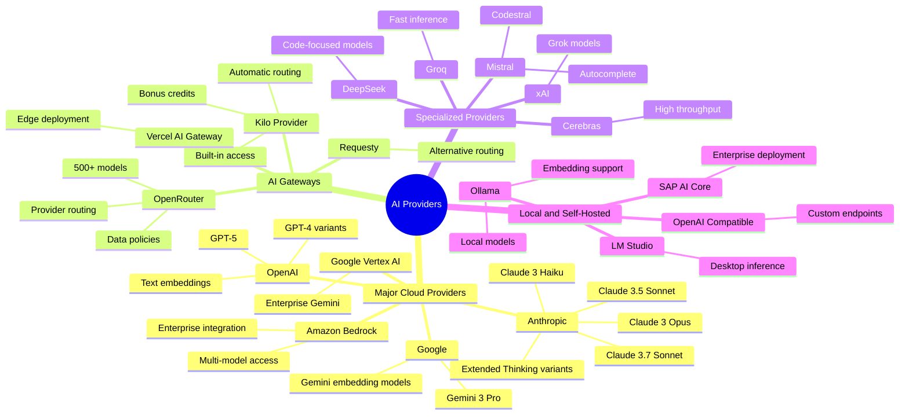
```mermaid
mindmap
  root((AI Providers))
    Major Cloud Providers
      Anthropic
        Claude 3.7 Sonnet
        Claude 3.5 Sonnet
        Claude 3 Opus
        Claude 3 Haiku
        Extended Thinking variants
      OpenAI
        GPT-5
        GPT-4 variants
        Text embeddings
      Google
        Gemini 3 Pro
        Gemini embedding models
      Amazon Bedrock
        Multi-model access
        Enterprise integration
      Google Vertex AI
        Enterprise Gemini
    AI Gateways
      OpenRouter
        500+ models
        Provider routing
        Data policies
      Kilo Provider
        Built-in access
        Automatic routing
        Bonus credits
      Vercel AI Gateway
        Edge deployment
      Requesty
        Alternative routing
    Specialized Providers
      DeepSeek
        Code-focused models
      Mistral
        Codestral
        Autocomplete
      xAI
        Grok models
      Groq
        Fast inference
      Cerebras
        High throughput
    Local and Self-Hosted
      Ollama
        Local models
        Embedding support
      LM Studio
        Desktop inference
      OpenAI Compatible
        Custom endpoints
      SAP AI Core
        Enterprise deployment
```

### Provider Capabilities Matrix

| Provider Category | Primary Use Case | Key Features | Limitations |
|------------------|------------------|--------------|-------------|
| **Anthropic** | Primary coding assistance | Extended thinking, prompt caching, 200K context | Rate limits by tier |
| **OpenAI** | General purpose, embeddings | Function calling, vision | Token-based pricing |
| **OpenRouter** | Model aggregation | 500+ models, provider routing | Dependent on upstream |
| **Kilo Provider** | Simplified access | No API key management, bonus credits | Requires account |
| **Ollama** | Local processing | Privacy, no API costs | Hardware dependent |
| **Gemini** | Cost-effective embeddings | Large context windows | Regional availability |

### Embedding Services for Codebase Indexing

The semantic search capability relies on embedding providers:

- **OpenAI Embeddings**: `text-embedding-3-small` and `text-embedding-3-large` for high-quality vector representations
- **Gemini Embeddings**: `gemini-embedding-001` as a cost-effective alternative
- **Ollama Embeddings**: `mxbai-embed-large`, `nomic-embed-text`, and `all-minilm` for local processing

---

## Agent Architecture Analysis

### Core Agent Components

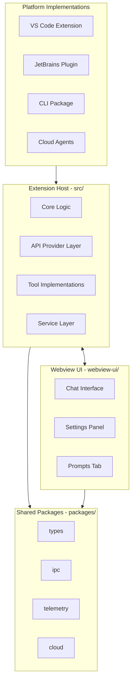
```mermaid
flowchart TB
    subgraph ExtensionHost[Extension Host - src/]
        Core[Core Logic]
        API[API Provider Layer]
        Tools[Tool Implementations]
        Services[Service Layer]
    end
    
    subgraph WebviewUI[Webview UI - webview-ui/]
        Chat[Chat Interface]
        Settings[Settings Panel]
        Prompts[Prompts Tab]
    end
    
    subgraph SharedPackages[Shared Packages - packages/]
        Types[types]
        IPC[ipc]
        Telemetry[telemetry]
        Cloud[cloud]
    end
    
    subgraph Platforms[Platform Implementations]
        VSCode[VS Code Extension]
        JetBrains[JetBrains Plugin]
        CLI[CLI Package]
        CloudAgent[Cloud Agents]
    end
    
    ExtensionHost <--> WebviewUI
    ExtensionHost --> SharedPackages
    WebviewUI --> SharedPackages
    Platforms --> ExtensionHost
```

### Mode System Architecture

Kilo Code operates through specialized modes, each defining a distinct agent persona with specific capabilities:

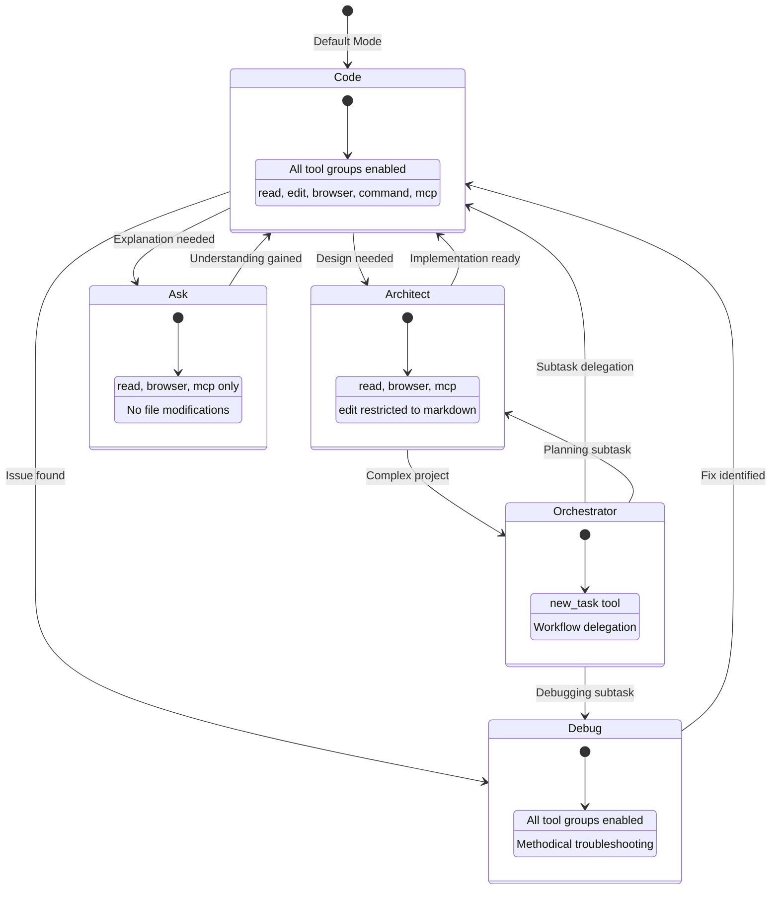
```mermaid
stateDiagram-v2
    [*] --> Code: Default Mode
    
    Code --> Architect: Design needed
    Code --> Debug: Issue found
    Code --> Ask: Explanation needed
    
    Architect --> Code: Implementation ready
    Architect --> Orchestrator: Complex project
    
    Debug --> Code: Fix identified
    
    Ask --> Code: Understanding gained
    
    Orchestrator --> Code: Subtask delegation
    Orchestrator --> Architect: Planning subtask
    Orchestrator --> Debug: Debugging subtask
    
    state Code {
        [*] --> FullAccess
        FullAccess: All tool groups enabled
        FullAccess: read, edit, browser, command, mcp
    }
    
    state Architect {
        [*] --> PlanningAccess
        PlanningAccess: read, browser, mcp
        PlanningAccess: edit restricted to markdown
    }
    
    state Debug {
        [*] --> DiagnosticAccess
        DiagnosticAccess: All tool groups enabled
        DiagnosticAccess: Methodical troubleshooting
    }
    
    state Ask {
        [*] --> ReadOnlyAccess
        ReadOnlyAccess: read, browser, mcp only
        ReadOnlyAccess: No file modifications
    }
    
    state Orchestrator {
        [*] --> CoordinationAccess
        CoordinationAccess: new_task tool
        CoordinationAccess: Workflow delegation
    }
```

### Mode Configuration Properties

Each mode is defined by:

| Property | Purpose | System Prompt Placement |
|----------|---------|------------------------|
| **slug** | Unique identifier for internal reference | N/A |
| **name** | Display name in UI | N/A |
| **roleDefinition** | Core identity and expertise | Beginning of system prompt |
| **groups** | Allowed tool sets and file permissions | Tool availability |
| **whenToUse** | Guidance for automated mode selection | Orchestrator decisions |
| **customInstructions** | Behavioral guidelines | End of system prompt |

### Tool System Architecture

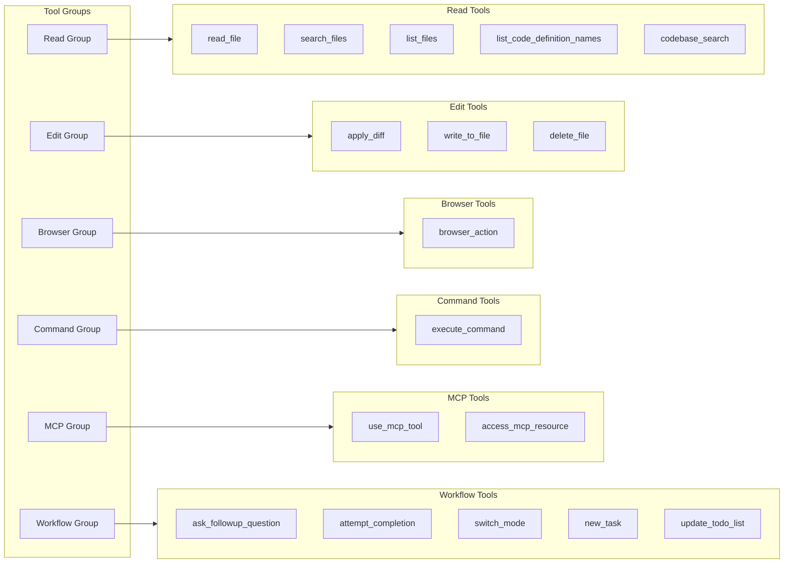
```mermaid
flowchart LR
    subgraph ToolGroups[Tool Groups]
        Read[Read Group]
        Edit[Edit Group]
        Browser[Browser Group]
        Command[Command Group]
        MCP[MCP Group]
        Workflow[Workflow Group]
    end
    
    subgraph ReadTools[Read Tools]
        read_file
        search_files
        list_files
        list_code_definition_names
        codebase_search
    end
    
    subgraph EditTools[Edit Tools]
        apply_diff
        write_to_file
        delete_file
    end
    
    subgraph BrowserTools[Browser Tools]
        browser_action
    end
    
    subgraph CommandTools[Command Tools]
        execute_command
    end
    
    subgraph MCPTools[MCP Tools]
        use_mcp_tool
        access_mcp_resource
    end
    
    subgraph WorkflowTools[Workflow Tools]
        ask_followup_question
        attempt_completion
        switch_mode
        new_task
        update_todo_list
    end
    
    Read --> ReadTools
    Edit --> EditTools
    Browser --> BrowserTools
    Command --> CommandTools
    MCP --> MCPTools
    Workflow --> WorkflowTools
```

### Tool Execution Flow

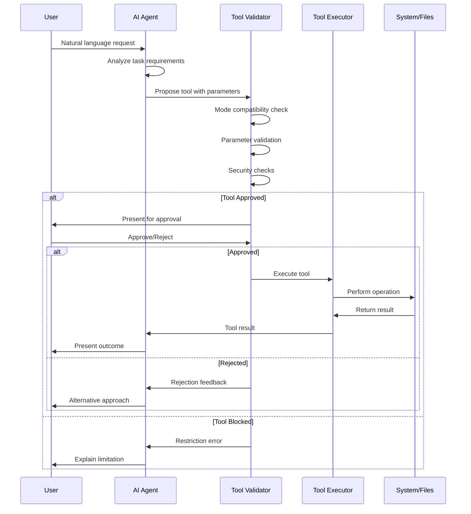
```mermaid
sequenceDiagram
    participant User
    participant Agent as AI Agent
    participant Validator as Tool Validator
    participant Executor as Tool Executor
    participant System as System/Files
    
    User->>Agent: Natural language request
    Agent->>Agent: Analyze task requirements
    Agent->>Validator: Propose tool with parameters
    
    Validator->>Validator: Mode compatibility check
    Validator->>Validator: Parameter validation
    Validator->>Validator: Security checks
    
    alt Tool Approved
        Validator->>User: Present for approval
        User->>Validator: Approve/Reject
        
        alt Approved
            Validator->>Executor: Execute tool
            Executor->>System: Perform operation
            System->>Executor: Return result
            Executor->>Agent: Tool result
            Agent->>User: Present outcome
        else Rejected
            Validator->>Agent: Rejection feedback
            Agent->>User: Alternative approach
        end
    else Tool Blocked
        Validator->>Agent: Restriction error
        Agent->>User: Explain limitation
    end
```

### Memory and State Management

Kilo Code employs multiple state management mechanisms:

1. **Session State**: Conversation history, task metadata, and repository context persisted as JSON blobs
2. **Checkpoint System**: Git-based shadow repository for workspace state versioning
3. **Task Stack**: Hierarchical task management for parent-child relationships in Orchestrator mode
4. **Mode Context**: Preserved mode state during task switches

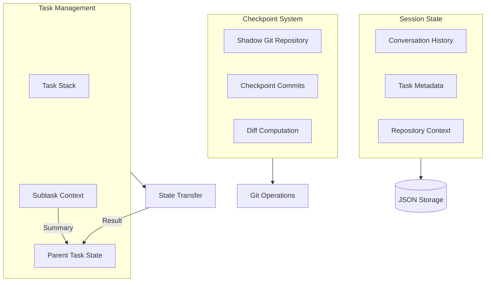
```mermaid
flowchart TB
    subgraph SessionState[Session State]
        ConvHistory[Conversation History]
        TaskMeta[Task Metadata]
        RepoContext[Repository Context]
    end
    
    subgraph CheckpointSystem[Checkpoint System]
        ShadowRepo[Shadow Git Repository]
        Commits[Checkpoint Commits]
        DiffEngine[Diff Computation]
    end
    
    subgraph TaskManagement[Task Management]
        TaskStack[Task Stack]
        ParentTask[Parent Task State]
        SubtaskContext[Subtask Context]
    end
    
    SessionState --> Storage[(JSON Storage)]
    CheckpointSystem --> GitOps[Git Operations]
    TaskManagement --> StateTransfer[State Transfer]
    
    StateTransfer --> |Result| ParentTask
    SubtaskContext --> |Summary| ParentTask
```

---

## Workflow and Process Flow Documentation

### Primary Task Execution Workflow

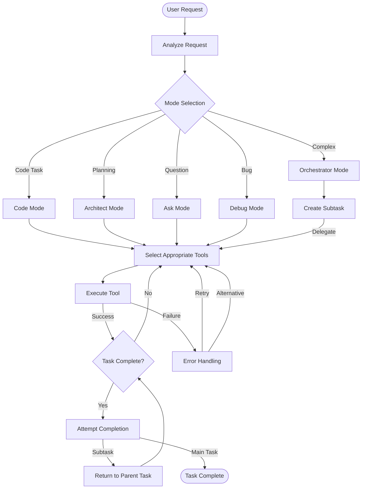
```mermaid
flowchart TB
    Start([User Request]) --> Analyze[Analyze Request]
    Analyze --> SelectMode{Mode Selection}
    
    SelectMode --> |Code Task| CodeMode[Code Mode]
    SelectMode --> |Planning| ArchitectMode[Architect Mode]
    SelectMode --> |Question| AskMode[Ask Mode]
    SelectMode --> |Bug| DebugMode[Debug Mode]
    SelectMode --> |Complex| OrchestratorMode[Orchestrator Mode]
    
    CodeMode --> ToolSelection[Select Appropriate Tools]
    ArchitectMode --> ToolSelection
    AskMode --> ToolSelection
    DebugMode --> ToolSelection
    
    OrchestratorMode --> CreateSubtask[Create Subtask]
    CreateSubtask --> |Delegate| ToolSelection
    
    ToolSelection --> ExecuteTool[Execute Tool]
    ExecuteTool --> |Success| CheckComplete{Task Complete?}
    ExecuteTool --> |Failure| HandleError[Error Handling]
    
    HandleError --> |Retry| ToolSelection
    HandleError --> |Alternative| ToolSelection
    
    CheckComplete --> |No| ToolSelection
    CheckComplete --> |Yes| AttemptCompletion[Attempt Completion]
    
    AttemptCompletion --> |Subtask| ReturnToParent[Return to Parent Task]
    AttemptCompletion --> |Main Task| End([Task Complete])
    
    ReturnToParent --> CheckComplete
```

### Orchestrator Mode Subtask Flow

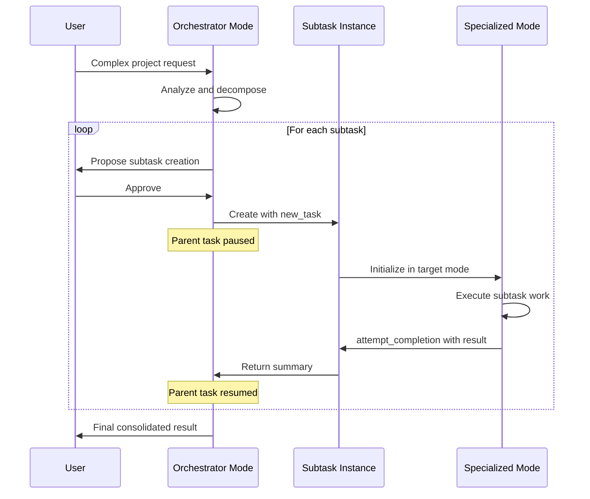
```mermaid
sequenceDiagram
    participant User
    participant Orchestrator as Orchestrator Mode
    participant Subtask as Subtask Instance
    participant Mode as Specialized Mode
    
    User->>Orchestrator: Complex project request
    Orchestrator->>Orchestrator: Analyze and decompose
    
    loop For each subtask
        Orchestrator->>User: Propose subtask creation
        User->>Orchestrator: Approve
        
        Orchestrator->>Subtask: Create with new_task
        Note over Orchestrator: Parent task paused
        
        Subtask->>Mode: Initialize in target mode
        Mode->>Mode: Execute subtask work
        Mode->>Subtask: attempt_completion with result
        
        Subtask->>Orchestrator: Return summary
        Note over Orchestrator: Parent task resumed
    end
    
    Orchestrator->>User: Final consolidated result
```

### Checkpoint Workflow

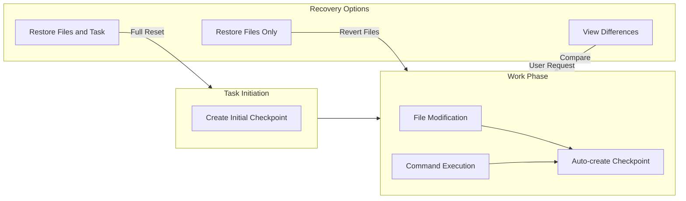
```mermaid
flowchart LR
    subgraph TaskStart[Task Initiation]
        InitCheckpoint[Create Initial Checkpoint]
    end
    
    subgraph WorkPhase[Work Phase]
        FileChange[File Modification]
        CommandExec[Command Execution]
        AutoCheckpoint[Auto-create Checkpoint]
    end
    
    subgraph Recovery[Recovery Options]
        ViewDiff[View Differences]
        RestoreFiles[Restore Files Only]
        RestoreAll[Restore Files and Task]
    end
    
    TaskStart --> WorkPhase
    FileChange --> AutoCheckpoint
    CommandExec --> AutoCheckpoint
    AutoCheckpoint --> WorkPhase
    
    WorkPhase --> |User Request| Recovery
    ViewDiff --> |Compare| WorkPhase
    RestoreFiles --> |Revert Files| WorkPhase
    RestoreAll --> |Full Reset| TaskStart
```

### Auto-Approval Decision Flow

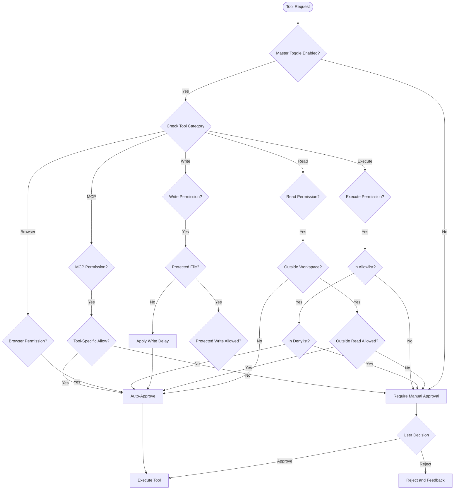
```mermaid
flowchart TB
    ToolRequest([Tool Request]) --> CheckMaster{Master Toggle Enabled?}
    
    CheckMaster --> |No| ManualApproval[Require Manual Approval]
    CheckMaster --> |Yes| CheckCategory{Check Tool Category}
    
    CheckCategory --> |Read| CheckReadPerm{Read Permission?}
    CheckCategory --> |Write| CheckWritePerm{Write Permission?}
    CheckCategory --> |Execute| CheckExecPerm{Execute Permission?}
    CheckCategory --> |Browser| CheckBrowserPerm{Browser Permission?}
    CheckCategory --> |MCP| CheckMCPPerm{MCP Permission?}
    
    CheckReadPerm --> |Yes| CheckOutside{Outside Workspace?}
    CheckOutside --> |No| AutoApprove[Auto-Approve]
    CheckOutside --> |Yes| CheckOutsideRead{Outside Read Allowed?}
    CheckOutsideRead --> |Yes| AutoApprove
    CheckOutsideRead --> |No| ManualApproval
    
    CheckWritePerm --> |Yes| CheckProtected{Protected File?}
    CheckProtected --> |No| ApplyDelay[Apply Write Delay]
    CheckProtected --> |Yes| CheckProtectedWrite{Protected Write Allowed?}
    ApplyDelay --> AutoApprove
    
    CheckExecPerm --> |Yes| CheckAllowlist{In Allowlist?}
    CheckAllowlist --> |Yes| CheckDenylist{In Denylist?}
    CheckDenylist --> |No| AutoApprove
    CheckDenylist --> |Yes| ManualApproval
    CheckAllowlist --> |No| ManualApproval
    
    CheckBrowserPerm --> |Yes| AutoApprove
    CheckMCPPerm --> |Yes| CheckToolSpecific{Tool-Specific Allow?}
    CheckToolSpecific --> |Yes| AutoApprove
    CheckToolSpecific --> |No| ManualApproval
    
    ManualApproval --> UserDecision{User Decision}
    UserDecision --> |Approve| Execute[Execute Tool]
    UserDecision --> |Reject| Reject[Reject and Feedback]
    AutoApprove --> Execute
```

---

## Data Flow Analysis

### Message Flow Architecture

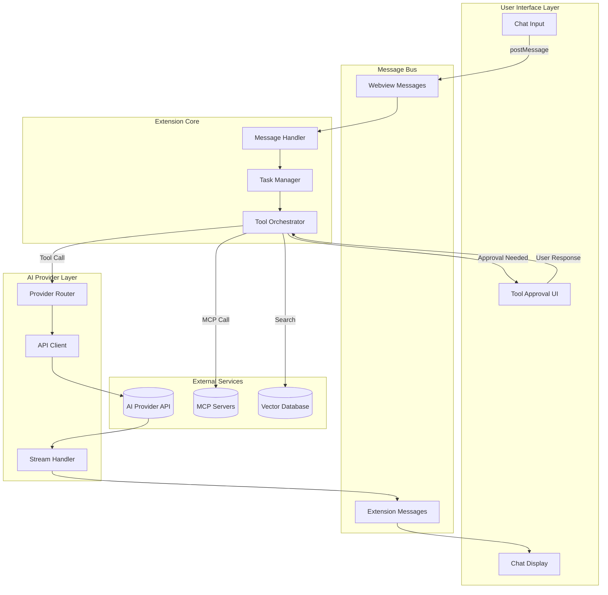
```mermaid
flowchart TB
    subgraph UserInterface[User Interface Layer]
        ChatInput[Chat Input]
        ChatDisplay[Chat Display]
        ToolApproval[Tool Approval UI]
    end
    
    subgraph MessageBus[Message Bus]
        WebviewMsg[Webview Messages]
        ExtensionMsg[Extension Messages]
    end
    
    subgraph ExtensionCore[Extension Core]
        MessageHandler[Message Handler]
        TaskManager[Task Manager]
        ToolOrchestrator[Tool Orchestrator]
    end
    
    subgraph AILayer[AI Provider Layer]
        ProviderRouter[Provider Router]
        APIClient[API Client]
        StreamHandler[Stream Handler]
    end
    
    subgraph ExternalServices[External Services]
        AIProvider[(AI Provider API)]
        MCPServer[(MCP Servers)]
        VectorDB[(Vector Database)]
    end
    
    ChatInput --> |postMessage| WebviewMsg
    WebviewMsg --> MessageHandler
    MessageHandler --> TaskManager
    TaskManager --> ToolOrchestrator
    
    ToolOrchestrator --> |Tool Call| ProviderRouter
    ProviderRouter --> APIClient
    APIClient --> AIProvider
    AIProvider --> StreamHandler
    StreamHandler --> ExtensionMsg
    ExtensionMsg --> ChatDisplay
    
    ToolOrchestrator --> |MCP Call| MCPServer
    ToolOrchestrator --> |Search| VectorDB
    
    ToolOrchestrator --> |Approval Needed| ToolApproval
    ToolApproval --> |User Response| ToolOrchestrator
```

### Codebase Indexing Data Flow

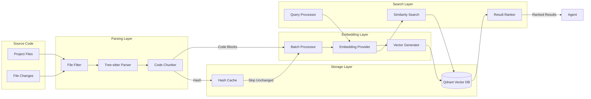
```mermaid
flowchart LR
    subgraph SourceCode[Source Code]
        Files[Project Files]
        Changes[File Changes]
    end
    
    subgraph Parsing[Parsing Layer]
        TreeSitter[Tree-sitter Parser]
        Chunker[Code Chunker]
        Filter[File Filter]
    end
    
    subgraph Embedding[Embedding Layer]
        EmbedProvider[Embedding Provider]
        BatchProcessor[Batch Processor]
        VectorGen[Vector Generator]
    end
    
    subgraph Storage[Storage Layer]
        Qdrant[(Qdrant Vector DB)]
        HashCache[Hash Cache]
    end
    
    subgraph Search[Search Layer]
        QueryProcessor[Query Processor]
        SimilaritySearch[Similarity Search]
        ResultRanker[Result Ranker]
    end
    
    Files --> Filter
    Changes --> Filter
    Filter --> TreeSitter
    TreeSitter --> Chunker
    Chunker --> |Code Blocks| BatchProcessor
    
    BatchProcessor --> EmbedProvider
    EmbedProvider --> VectorGen
    VectorGen --> Qdrant
    
    Chunker --> |Hash| HashCache
    HashCache --> |Skip Unchanged| BatchProcessor
    
    QueryProcessor --> EmbedProvider
    EmbedProvider --> SimilaritySearch
    SimilaritySearch --> Qdrant
    Qdrant --> ResultRanker
    ResultRanker --> |Ranked Results| Agent
```

### Session and Task Data Flow

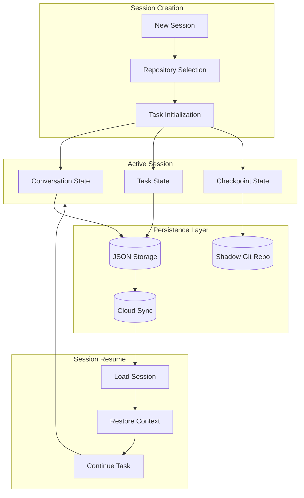
```mermaid
flowchart TB
    subgraph SessionCreation[Session Creation]
        NewSession[New Session]
        RepoSelection[Repository Selection]
        TaskInit[Task Initialization]
    end
    
    subgraph ActiveSession[Active Session]
        ConvState[Conversation State]
        TaskState[Task State]
        CheckpointState[Checkpoint State]
    end
    
    subgraph Persistence[Persistence Layer]
        JSONBlob[(JSON Storage)]
        ShadowGit[(Shadow Git Repo)]
        CloudSync[(Cloud Sync)]
    end
    
    subgraph SessionResume[Session Resume]
        LoadSession[Load Session]
        RestoreContext[Restore Context]
        ContinueTask[Continue Task]
    end
    
    NewSession --> RepoSelection
    RepoSelection --> TaskInit
    TaskInit --> ConvState
    TaskInit --> TaskState
    TaskInit --> CheckpointState
    
    ConvState --> JSONBlob
    TaskState --> JSONBlob
    CheckpointState --> ShadowGit
    
    JSONBlob --> CloudSync
    
    CloudSync --> LoadSession
    LoadSession --> RestoreContext
    RestoreContext --> ContinueTask
    ContinueTask --> ActiveSession
```

---

## Integration Points and External Dependencies

### External Service Integration Map

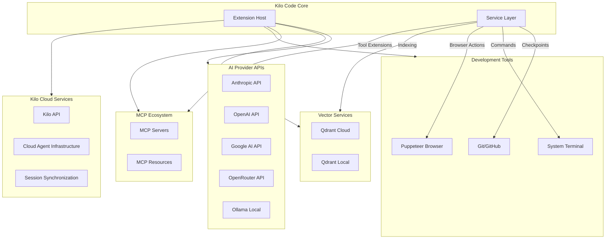
```mermaid
flowchart TB
    subgraph KiloCode[Kilo Code Core]
        Extension[Extension Host]
        Services[Service Layer]
    end
    
    subgraph AIProviders[AI Provider APIs]
        Anthropic[Anthropic API]
        OpenAI[OpenAI API]
        Google[Google AI API]
        OpenRouter[OpenRouter API]
        Ollama[Ollama Local]
    end
    
    subgraph VectorServices[Vector Services]
        QdrantCloud[Qdrant Cloud]
        QdrantLocal[Qdrant Local]
    end
    
    subgraph MCPEcosystem[MCP Ecosystem]
        MCPServers[MCP Servers]
        MCPResources[MCP Resources]
    end
    
    subgraph DevTools[Development Tools]
        Git[Git/GitHub]
        Terminal[System Terminal]
        Browser[Puppeteer Browser]
    end
    
    subgraph CloudServices[Kilo Cloud Services]
        KiloAPI[Kilo API]
        CloudAgents[Cloud Agent Infrastructure]
        SessionSync[Session Synchronization]
    end
    
    Extension --> AIProviders
    Extension --> VectorServices
    Extension --> MCPEcosystem
    Extension --> DevTools
    Extension --> CloudServices
    
    Services --> |Checkpoints| Git
    Services --> |Commands| Terminal
    Services --> |Browser Actions| Browser
    Services --> |Indexing| VectorServices
    Services --> |Tool Extensions| MCPEcosystem
```

### MCP Integration Architecture

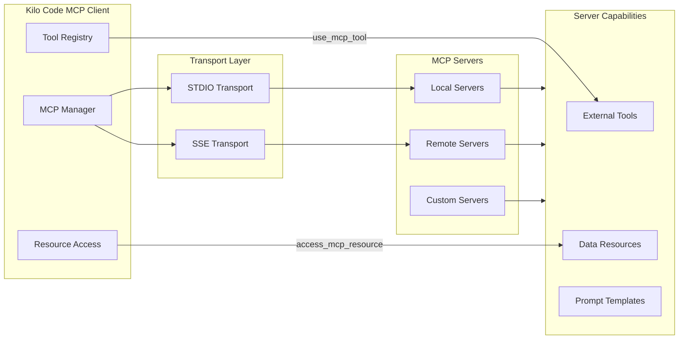
```mermaid
flowchart LR
    subgraph KiloClient[Kilo Code MCP Client]
        MCPManager[MCP Manager]
        ToolRegistry[Tool Registry]
        ResourceAccess[Resource Access]
    end
    
    subgraph Transport[Transport Layer]
        STDIO[STDIO Transport]
        SSE[SSE Transport]
    end
    
    subgraph MCPServers[MCP Servers]
        LocalServer[Local Servers]
        RemoteServer[Remote Servers]
        CustomServer[Custom Servers]
    end
    
    subgraph Capabilities[Server Capabilities]
        Tools[External Tools]
        Resources[Data Resources]
        Prompts[Prompt Templates]
    end
    
    MCPManager --> STDIO
    MCPManager --> SSE
    
    STDIO --> LocalServer
    SSE --> RemoteServer
    
    LocalServer --> Capabilities
    RemoteServer --> Capabilities
    CustomServer --> Capabilities
    
    ToolRegistry --> |use_mcp_tool| Tools
    ResourceAccess --> |access_mcp_resource| Resources
```

### Platform Integration Points

| Platform | Integration Method | Key Dependencies |
|----------|-------------------|------------------|
| **VS Code** | Extension API | VS Code Extension Host, Webview API, Terminal API |
| **JetBrains** | Plugin + Node.js Host | JCEF, JetBrains Toolbox, Node.js Runtime |
| **CLI** | Standalone Package | Node.js, Ink React, Terminal UI |
| **Cloud Agents** | Container Infrastructure | Linux Container, GitHub Integration, Git CLI |

### External Dependencies Summary

| Category | Dependency | Purpose | Required |
|----------|------------|---------|----------|
| **Runtime** | Node.js | Extension backend, CLI execution | Yes |
| **Version Control** | Git | Checkpoints, Cloud Agent commits | Yes for checkpoints |
| **Vector Database** | Qdrant | Codebase indexing storage | For indexing only |
| **Browser Automation** | Puppeteer | Browser actions | For browser tool |
| **Code Parsing** | Tree-sitter | Semantic code chunking | For indexing |
| **Search** | Ripgrep | Fast file searching | Bundled/fallback |

---

## System Architecture Diagrams

### Complete System Architecture

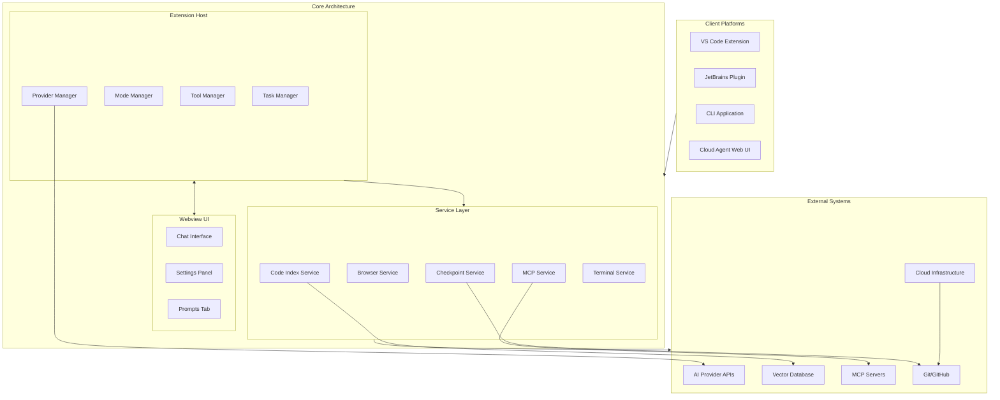
```mermaid
flowchart TB
    subgraph Clients[Client Platforms]
        VSCode[VS Code Extension]
        JetBrains[JetBrains Plugin]
        CLI[CLI Application]
        WebUI[Cloud Agent Web UI]
    end
    
    subgraph CoreArchitecture[Core Architecture]
        subgraph ExtHost[Extension Host]
            TaskMgr[Task Manager]
            ModeMgr[Mode Manager]
            ToolMgr[Tool Manager]
            ProviderMgr[Provider Manager]
        end
        
        subgraph WebView[Webview UI]
            ChatUI[Chat Interface]
            SettingsUI[Settings Panel]
            PromptsUI[Prompts Tab]
        end
        
        subgraph Services[Service Layer]
            CheckpointSvc[Checkpoint Service]
            BrowserSvc[Browser Service]
            MCPSvc[MCP Service]
            IndexSvc[Code Index Service]
            TerminalSvc[Terminal Service]
        end
    end
    
    subgraph ExternalSystems[External Systems]
        AIAPIs[AI Provider APIs]
        VectorDB[Vector Database]
        MCPServers[MCP Servers]
        GitSystem[Git/GitHub]
        CloudInfra[Cloud Infrastructure]
    end
    
    Clients --> CoreArchitecture
    ExtHost <--> WebView
    ExtHost --> Services
    Services --> ExternalSystems
    ProviderMgr --> AIAPIs
    IndexSvc --> VectorDB
    MCPSvc --> MCPServers
    CheckpointSvc --> GitSystem
    CloudInfra --> GitSystem
```

### Agent Lifecycle State Diagram

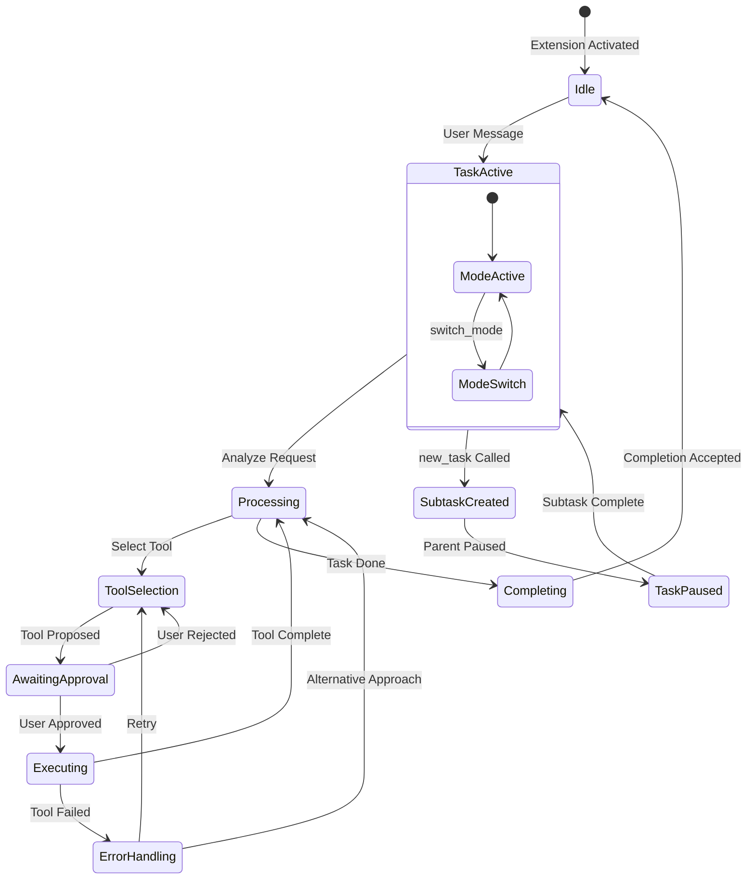
```mermaid
stateDiagram-v2
    [*] --> Idle: Extension Activated
    
    Idle --> TaskActive: User Message
    
    TaskActive --> Processing: Analyze Request
    Processing --> ToolSelection: Select Tool
    
    ToolSelection --> AwaitingApproval: Tool Proposed
    AwaitingApproval --> Executing: User Approved
    AwaitingApproval --> ToolSelection: User Rejected
    
    Executing --> Processing: Tool Complete
    Executing --> ErrorHandling: Tool Failed
    
    ErrorHandling --> ToolSelection: Retry
    ErrorHandling --> Processing: Alternative Approach
    
    Processing --> Completing: Task Done
    Completing --> Idle: Completion Accepted
    
    TaskActive --> SubtaskCreated: new_task Called
    SubtaskCreated --> TaskPaused: Parent Paused
    TaskPaused --> TaskActive: Subtask Complete
    
    state TaskActive {
        [*] --> ModeActive
        ModeActive --> ModeSwitch: switch_mode
        ModeSwitch --> ModeActive
    }
```

### Tool Execution Sequence

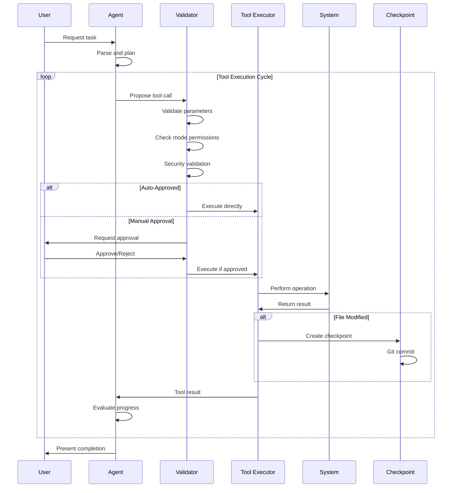
```mermaid
sequenceDiagram
    participant U as User
    participant A as Agent
    participant V as Validator
    participant T as Tool Executor
    participant S as System
    participant C as Checkpoint
    
    U->>A: Request task
    A->>A: Parse and plan
    
    loop Tool Execution Cycle
        A->>V: Propose tool call
        V->>V: Validate parameters
        V->>V: Check mode permissions
        V->>V: Security validation
        
        alt Auto-Approved
            V->>T: Execute directly
        else Manual Approval
            V->>U: Request approval
            U->>V: Approve/Reject
            V->>T: Execute if approved
        end
        
        T->>S: Perform operation
        S->>T: Return result
        
        alt File Modified
            T->>C: Create checkpoint
            C->>C: Git commit
        end
        
        T->>A: Tool result
        A->>A: Evaluate progress
    end
    
    A->>U: Present completion
```

---

## YOLO Mode and Autonomous Operation

### YOLO Mode Architecture

YOLO Mode, which stands for "You Only Live Once," represents the maximum autonomy configuration in Kilo Code. When enabled, it activates all auto-approve permissions simultaneously through the master toggle, granting the AI agent complete autonomy to perform operations without user confirmation.

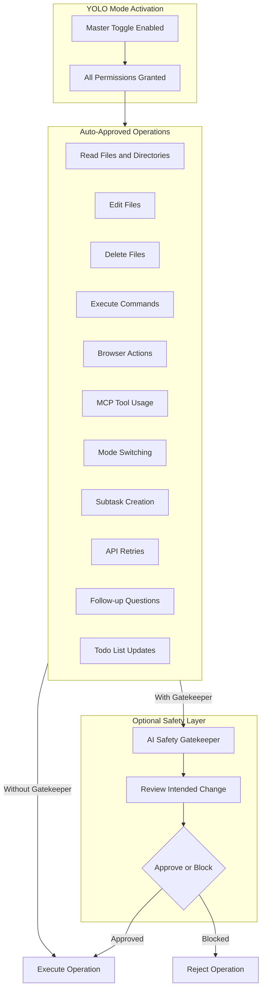
```mermaid
flowchart TB
    subgraph YOLOActivation[YOLO Mode Activation]
        MasterToggle[Master Toggle Enabled]
        AllPermissions[All Permissions Granted]
    end
    
    subgraph AutoApprovedOps[Auto-Approved Operations]
        ReadOps[Read Files and Directories]
        WriteOps[Edit Files]
        DeleteOps[Delete Files]
        ExecOps[Execute Commands]
        BrowserOps[Browser Actions]
        MCPOps[MCP Tool Usage]
        ModeOps[Mode Switching]
        SubtaskOps[Subtask Creation]
        RetryOps[API Retries]
        QuestionOps[Follow-up Questions]
        TodoOps[Todo List Updates]
    end
    
    subgraph SafetyLayer[Optional Safety Layer]
        AIGatekeeper[AI Safety Gatekeeper]
        ReviewAction[Review Intended Change]
        ApproveBlock{Approve or Block}
    end
    
    MasterToggle --> AllPermissions
    AllPermissions --> AutoApprovedOps
    
    AutoApprovedOps --> |With Gatekeeper| AIGatekeeper
    AIGatekeeper --> ReviewAction
    ReviewAction --> ApproveBlock
    ApproveBlock --> |Approved| Execute[Execute Operation]
    ApproveBlock --> |Blocked| Reject[Reject Operation]
    
    AutoApprovedOps --> |Without Gatekeeper| Execute
```

### AI Safety Gatekeeper

When YOLO mode is enabled, users can optionally activate an AI Safety Gatekeeper that provides an additional layer of protection:

- **Purpose**: Reviews every intended change before execution
- **Mechanism**: Uses a secondary AI model to evaluate proposed actions
- **Recommended Model**: Small, fast models like OpenAI gpt-oss-safeguard-20b
- **Trade-offs**: Incurs additional API costs and latency but provides intelligent action filtering

### Loop Prevention Mechanisms

Kilo Code implements several mechanisms to prevent the agent from getting stuck in infinite loops or repetitive failure patterns:

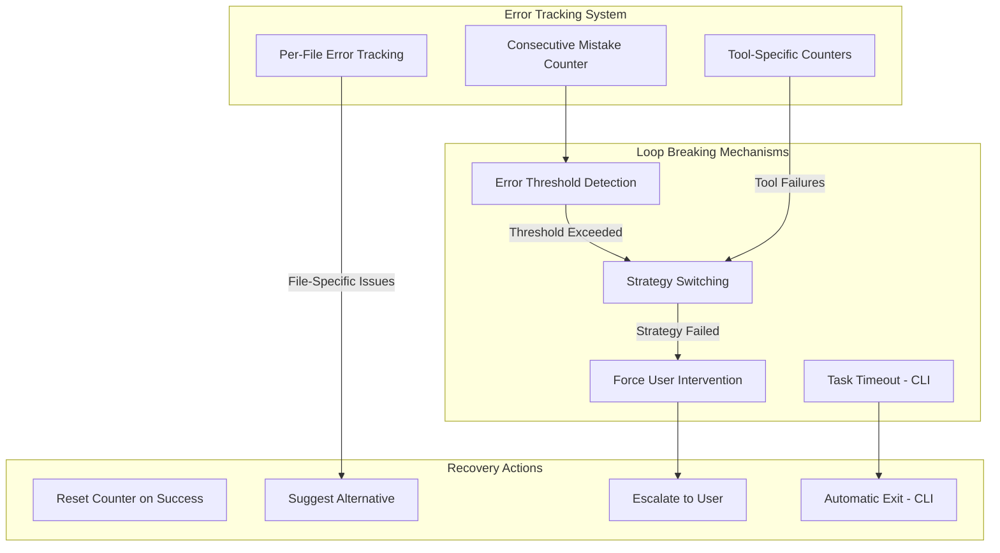
```mermaid
flowchart TB
    subgraph ErrorTracking[Error Tracking System]
        ConsecutiveCount[Consecutive Mistake Counter]
        PerFileTracking[Per-File Error Tracking]
        ToolSpecificCount[Tool-Specific Counters]
    end
    
    subgraph LoopBreakers[Loop Breaking Mechanisms]
        ErrorThreshold[Error Threshold Detection]
        StrategySwitch[Strategy Switching]
        UserIntervention[Force User Intervention]
        TaskTimeout[Task Timeout - CLI]
    end
    
    subgraph RecoveryActions[Recovery Actions]
        ResetCounter[Reset Counter on Success]
        AlternativeApproach[Suggest Alternative]
        EscalateToUser[Escalate to User]
        AutoExit[Automatic Exit - CLI]
    end
    
    ConsecutiveCount --> ErrorThreshold
    ErrorThreshold --> |Threshold Exceeded| StrategySwitch
    StrategySwitch --> |Strategy Failed| UserIntervention
    UserIntervention --> EscalateToUser
    
    PerFileTracking --> |File-Specific Issues| AlternativeApproach
    ToolSpecificCount --> |Tool Failures| StrategySwitch
    
    TaskTimeout --> AutoExit
```

#### Consecutive Mistake Counter

The system tracks consecutive errors at multiple levels:

| Tracking Level | Scope | Reset Condition | Purpose |
|---------------|-------|-----------------|---------|
| **Per-File** | `consecutiveMistakeCountForApplyDiff` | Successful operation on file | Prevents repeated diff failures on same file |
| **Per-Tool** | Tool-specific counters | Successful tool execution | Detects tool-specific issues |
| **Global** | Session-level tracking | User intervention or success | Overall session health monitoring |

#### Apply Diff Loop Prevention

The `apply_diff` tool specifically implements loop prevention through:

1. **Fuzzy Matching Confidence Thresholds**: Configurable thresholds of 0.8-1.0 prevent false matches
2. **Buffer Lines Context**: Uses 40 lines of context to improve match accuracy
3. **Overlapping Window Approach**: Searches large files systematically
4. **Error Increment on Failure**: Increments `consecutiveMistakeCountForApplyDiff` when matches fail
5. **Strategy Fallback**: Can switch between exact and fuzzy matching strategies

#### Write-to-File Safety

The `write_to_file` tool includes:

- **Content Truncation Detection**: Compares actual content with provided line count
- **Incomplete Content Warnings**: Alerts when content appears truncated
- **Counter Reset on Success**: Resets consecutive mistake counter after successful writes

### Autonomous Mode Safeguards in CLI

When running in autonomous mode with the `--auto` flag, additional safeguards apply:

```mermaid
sequenceDiagram
    participant CLI as CLI Process
    participant Agent as AI Agent
    participant Config as Auto-Approval Config
    participant Timer as Timeout Timer
    
    CLI->>Timer: Start timeout countdown
    CLI->>Agent: Initialize with prompt
    
    loop Task Execution
        Agent->>Config: Check operation permission
        
        alt Operation Allowed
            Config->>Agent: Auto-approve
            Agent->>Agent: Execute operation
        else Operation Denied
            Config->>Agent: Block operation
            Agent->>Agent: Skip or find alternative
        end
        
        Agent->>CLI: Report progress
        
        alt Timeout Reached
            Timer->>CLI: Signal timeout
            CLI->>Agent: Force termination
            CLI->>CLI: Exit with code 124
        end
    end
    
    Agent->>CLI: Task complete
    CLI->>CLI: Exit with code 0
```

#### Autonomous Mode Configuration

| Setting | Purpose | Default |
|---------|---------|---------|
| **Timeout** | Maximum execution time | Configurable via `--timeout` |
| **Allowed Commands** | Whitelist of auto-executable commands | `npm`, `git`, `pnpm` |
| **Denied Commands** | Blacklist that overrides allowlist | `rm -rf`, `sudo` |
| **Follow-up Response** | Auto-response for questions | Make autonomous decision |

#### Exit Codes

| Code | Meaning | Trigger |
|------|---------|---------|
| `0` | Success | Task completed normally |
| `124` | Timeout | Task exceeded time limit |
| `1` | Error | Initialization or execution failure |

### Follow-up Question Auto-Response

In YOLO and autonomous modes, follow-up questions are handled automatically:

1. **Timeout-Based Selection**: First suggested answer selected after configurable timeout of 1-300 seconds
2. **Visual Countdown**: UI shows remaining time before auto-selection
3. **Override Options**: User can cancel by clicking different suggestion, editing, or typing
4. **Autonomous Message**: In CLI auto mode, agent receives instruction to make autonomous decisions

### Best Practices for YOLO Mode

#### When to Use YOLO Mode

- Rapid prototyping in isolated environments
- Trusted, low-stakes projects
- Automated CI/CD pipelines with proper safeguards
- Testing workflows where speed is critical

#### When NOT to Use YOLO Mode

- Production code or sensitive projects
- Working with important data
- Any situation where mistakes could be costly
- Environments without proper backups or version control

#### Recommended Safeguards

1. **Enable AI Safety Gatekeeper** for intelligent action filtering
2. **Use Checkpoints** to enable easy rollback
3. **Configure Command Denylist** to block dangerous operations
4. **Set Appropriate Timeouts** in autonomous mode
5. **Monitor Console Output** for unexpected behavior
6. **Maintain Version Control** as ultimate safety net

---

## Agent Prompts and Role Definitions

Kilo Code uses a sophisticated prompt system to define agent behavior across different modes. The system prompt is constructed dynamically based on the active mode, custom instructions, rules, and skills.

### System Prompt Architecture

```mermaid
flowchart TB
    subgraph PromptConstruction[System Prompt Construction]
        RoleDef[Role Definition]
        ToolDefs[Tool Definitions]
        ModeInstr[Mode Instructions]
        CustomInstr[Custom Instructions]
        Rules[Custom Rules]
        Skills[Active Skills]
        Context[Environment Context]
    end
    
    subgraph PromptOrder[Prompt Assembly Order]
        P1[1. Role Definition - Beginning]
        P2[2. Tool Definitions]
        P3[3. Mode Capabilities]
        P4[4. Available Skills]
        P5[5. Custom Rules]
        P6[6. Custom Instructions - End]
        P7[7. Environment Details]
    end
    
    RoleDef --> P1
    ToolDefs --> P2
    ModeInstr --> P3
    Skills --> P4
    Rules --> P5
    CustomInstr --> P6
    Context --> P7
    
    P1 --> SystemPrompt[Complete System Prompt]
    P2 --> SystemPrompt
    P3 --> SystemPrompt
    P4 --> SystemPrompt
    P5 --> SystemPrompt
    P6 --> SystemPrompt
    P7 --> SystemPrompt
```

### Built-in Mode Role Definitions

#### Code Mode

| Property | Value |
|----------|-------|
| **Slug** | `code` |
| **Name** | Code |
| **Role Definition** | A skilled software engineer with expertise in programming languages, design patterns, and best practices |
| **Tool Access** | Full access to all tool groups: `read`, `edit`, `browser`, `command`, `mcp` |
| **Special Features** | No tool restrictions—full flexibility for all coding tasks |

#### Ask Mode

| Property | Value |
|----------|-------|
| **Slug** | `ask` |
| **Name** | Ask |
| **Role Definition** | A knowledgeable technical assistant focused on answering questions without changing your codebase |
| **Tool Access** | Limited access: `read`, `browser`, `mcp` only - cannot edit files or run commands |
| **Special Features** | Optimized for informative responses without modifying your project |

#### Architect Mode

| Property | Value |
|----------|-------|
| **Slug** | `architect` |
| **Name** | Architect |
| **Role Definition** | An experienced technical leader and planner who helps design systems and create implementation plans |
| **Tool Access** | Access to `read`, `browser`, `mcp`, and restricted `edit` for markdown files only |
| **Special Features** | Follows a structured approach from information gathering to detailed planning |

#### Debug Mode

| Property | Value |
|----------|-------|
| **Slug** | `debug` |
| **Name** | Debug |
| **Role Definition** | An expert problem solver specializing in systematic troubleshooting and diagnostics |
| **Tool Access** | Full access to all tool groups: `read`, `edit`, `browser`, `command`, `mcp` |
| **Special Features** | Uses a methodical approach of analyzing, narrowing possibilities, and fixing issues |

#### Orchestrator Mode

| Property | Value |
|----------|-------|
| **Slug** | `orchestrator` |
| **Name** | Orchestrator |
| **Role Definition** | A strategic workflow orchestrator who coordinates complex tasks by delegating them to appropriate specialized modes. Has comprehensive understanding of each mode's capabilities and limitations, allowing effective breakdown of complex problems into discrete tasks. |
| **Tool Access** | Limited access to create new tasks and coordinate workflows |
| **Special Features** | Uses the `new_task` tool to delegate work to other modes |

**Orchestrator Custom Instructions:**
- Break down complex tasks into logical subtasks delegated to appropriate specialized modes
- Use `new_task` tool with comprehensive instructions including all necessary context
- Define clear scope specifying exactly what each subtask should accomplish
- Instruct subtasks to signal completion using `attempt_completion` with thorough summaries
- Track and manage progress of all subtasks
- Synthesize results and provide comprehensive overview when all subtasks complete
- Suggest workflow improvements based on completed subtask results

### Custom Mode Examples

#### Translate Mode

```yaml
slug: translate
name: Translate
roleDefinition: >
  You are Kilo Code, a linguistic specialist focused on translating
  and managing localization files. Your responsibility is to help
  maintain and update translation files for the application, ensuring
  consistency and accuracy across all language resources.
groups:
  - read
  - - edit
    - fileRegex: src/i18n/locales/|src/package\.nls.*\.json
      description: Translation files only
customInstructions: >
  When translating content:
  - Maintain consistent terminology across all translations
  - Respect the JSON structure of translation files
  - Consider context when translating UI strings
  - Watch for placeholders like {{variable}} and preserve them
  - Be mindful of text length in UI elements
  - Kilo, Kilo Code and similar terms are proper nouns - do not translate
```

#### Test Mode

```yaml
slug: test
name: Test
roleDefinition: >
  You are Kilo Code, a Jest testing specialist with deep expertise in:
  - Writing and maintaining Jest test suites
  - Test-driven development practices
  - Mocking and stubbing with Jest
  - Integration testing strategies
  - TypeScript testing patterns
  - Code coverage analysis
  - Test performance optimization
groups:
  - read
  - browser
  - command
  - - edit
    - fileRegex: __tests__/.*|__mocks__/.*|\.test\.(ts|tsx|js|jsx)$|jest\.config\.(js|ts)$
      description: Test files, mocks, and Jest configuration
customInstructions: >
  When writing tests:
  - Always use describe/it blocks for clear test organization
  - Include meaningful test descriptions
  - Use beforeEach/afterEach for proper test isolation
  - Implement proper error cases
  - Add JSDoc comments for complex test scenarios
  - Ensure mocks are properly typed
  - Verify both positive and negative test cases
```

### Prompt Customization Layers

#### Layer 1: Global Custom Instructions

Applied across all modes and workspaces. Set via the Modes Tab under "Custom Instructions for All Modes."

**Example Use Cases:**
- Enforce coding style guidelines
- Specify preferred libraries or frameworks
- Define project-agnostic conventions
- Adjust agent tone or personality

#### Layer 2: Mode-Specific Custom Instructions

Applied only when a specific mode is active. Set via the Modes Tab for individual modes.

**Example Use Cases:**
- Architect mode: Require Mermaid diagrams for all designs
- Code mode: Enforce specific testing patterns
- Debug mode: Require logging before fixes

#### Layer 3: Custom Rules - Project Level

Stored in `.kilocode/rules/` directory within the project. Applied to all interactions within that workspace.

**Example Rules:**
```markdown
# Code Style
- Use spaces for indentation with width of 4 spaces
- Use camelCase for variable names
- Write unit tests for all new functions

# Restricted Files
Files in this list contain sensitive data and MUST NOT be read:
- supersecrets.txt
- credentials.json
- .env
```

#### Layer 4: Custom Rules - Global Level

Stored in `~/.kilocode/rules/` directory. Applied across all projects.

#### Layer 5: Mode-Specific Rules

Stored in `.kilocode/rules-{mode-slug}/` directory for project-specific mode rules.

### Skills Integration

Skills extend agent capabilities with specialized knowledge loaded on-demand:

```yaml
# Example Skill: API Design
---
name: api-design
description: REST API design best practices and conventions
---

# API Design Guidelines

When designing REST APIs, follow these conventions:

## URL Structure
- Use plural nouns for resources: /users, /orders
- Use kebab-case for multi-word resources: /order-items
- Nest related resources: /users/{id}/orders

## HTTP Methods
- GET: Retrieve resources
- POST: Create new resources
- PUT: Replace entire resource
- PATCH: Partial update
- DELETE: Remove resource
```

**Skill Loading Locations:**
- Global skills: `~/.kilocode/skills/`
- Project skills: `.kilocode/skills/`
- Mode-specific skills: `~/.kilocode/skills-{mode}/` or `.kilocode/skills-{mode}/`

### Memory Bank Pattern

The Memory Bank is an advanced prompt pattern for maintaining project context across sessions:

**Core Memory Bank Files:**
| File | Purpose |
|------|---------|
| `brief.md` | Foundation document defining core requirements and goals |
| `product.md` | Why the project exists, problems it solves, user experience goals |
| `context.md` | Current work focus, recent changes, next steps |
| `architecture.md` | System architecture, source paths, key technical decisions |
| `tech.md` | Technologies used, development setup, dependencies |
| `tasks.md` | Documentation of repetitive tasks and workflows |

**Memory Bank Workflow:**
1. Agent reads ALL memory bank files at task start
2. Includes `[Memory Bank: Active]` or `[Memory Bank: Missing]` in response
3. Updates `context.md` at task completion
4. Suggests memory bank updates for significant changes

### Prompt Engineering Best Practices

#### Effective Prompts

| Good Practice | Example |
|--------------|---------|
| Be specific | "Fix the bug in the `calculateTotal` function that causes incorrect results" |
| Provide context | "`@/src/utils.ts` Refactor the `calculateTotal` function to use async/await" |
| Break down tasks | Divide complex tasks into smaller, well-defined steps |
| Give examples | Provide specific coding style or pattern examples |
| Specify output format | Request JSON, Markdown, or specific structure |

#### Think-Then-Do Process

1. **Analyze**: Ask agent to analyze current code and identify problems
2. **Plan**: Have agent outline steps to complete the task
3. **Execute**: Instruct agent to implement the plan step by step
4. **Review**: Carefully review results before proceeding

### Environment Context Injection

The system prompt includes dynamic environment details:

- **Operating System**: Current OS information
- **Default Shell**: User's shell configuration
- **Home Directory**: User's home path
- **Current Workspace**: Active project directory
- **File Structure**: Recursive listing of workspace files
- **Active Terminals**: Running terminal processes
- **Current Time**: ISO 8601 timestamp
- **Current Mode**: Active mode slug and name
- **Current Cost**: Session API cost tracking

---

## Conclusion

Kilo Code represents a sophisticated agentic AI platform built on principles of modularity, extensibility, and safety. The architecture successfully balances autonomous operation with user control through its multi-layered approval system, checkpoint-based state management, and mode-specific tool restrictions.

Key architectural strengths include:

1. **Provider Agnosticism**: The abstraction layer supporting 32+ AI providers ensures flexibility and resilience
2. **Tool Orchestration**: The sophisticated tool system with mode-based access control enables safe autonomous operation
3. **State Management**: The checkpoint system provides robust recovery capabilities without requiring external version control
4. **Extensibility**: The MCP integration and skills system allow unlimited capability expansion
5. **Multi-Platform Support**: Unified architecture across VS Code, JetBrains, CLI, and cloud environments

The system's design enables it to serve as both a powerful coding assistant for individual developers and a scalable platform for enterprise deployment, with clear paths for customization through custom modes, skills, and MCP server integrations.
