# OpenCode Architecture Report

## Executive Summary

OpenCode is a sophisticated AI-powered coding assistant platform designed to provide intelligent code generation, analysis, and manipulation capabilities through a multi-agent architecture. The system operates as a monorepo containing several interconnected packages that together form a comprehensive development assistance ecosystem.

### Core Purpose and Philosophy

The platform serves as an intelligent intermediary between developers and large language models, providing a structured environment for AI-assisted software development. The architectural philosophy centers on:

- **Multi-Provider Flexibility**: Supporting 20+ AI providers through a unified interface, allowing users to leverage different models based on their needs and preferences
- **Agent-Based Task Decomposition**: Employing specialized agents for different types of tasks, from code exploration to complex multi-step builds
- **Permission-Controlled Execution**: Implementing granular permission systems to ensure safe and controlled AI operations
- **Event-Driven Communication**: Using a publish-subscribe bus architecture for real-time updates and loose coupling between components
- **Extensibility Through Plugins**: Providing hook-based extensibility for authentication, tools, and event handling

### System Overview

The OpenCode platform consists of five primary packages:

1. **opencode** - The core runtime containing agents, providers, sessions, tools, and server infrastructure
2. **sdk** - JavaScript SDK for programmatic interaction with the OpenCode server
3. **plugin** - Plugin system for extending functionality through hooks
4. **ui** - Web-based user interface built with Solid.js
5. **slack** - Slack integration for team collaboration

---

## AI Tools and Capabilities Inventory

### Provider Integration Architecture

OpenCode integrates with a comprehensive array of AI providers through the Vercel AI SDK, providing a unified interface for model interaction regardless of the underlying provider.

#### Bundled AI SDK Providers

The system includes direct integrations with the following providers:

| Provider | SDK Package | Primary Use Case |
|----------|-------------|------------------|
| Anthropic | @ai-sdk/anthropic | Claude models for complex reasoning |
| OpenAI | @ai-sdk/openai | GPT models and responses API |
| Google | @ai-sdk/google | Gemini models |
| Google Vertex | @ai-sdk/google-vertex | Enterprise Gemini deployment |
| Azure | @ai-sdk/azure | Azure OpenAI Service |
| Amazon Bedrock | @ai-sdk/amazon-bedrock | AWS-hosted models |
| xAI | @ai-sdk/xai | Grok models |
| Mistral | @ai-sdk/mistral | Mistral AI models |
| Groq | @ai-sdk/groq | High-speed inference |
| DeepInfra | @ai-sdk/deepinfra | Open-source model hosting |
| Cerebras | @ai-sdk/cerebras | Ultra-fast inference |
| Cohere | @ai-sdk/cohere | Enterprise NLP |
| Together AI | @ai-sdk/togetherai | Open-source model hosting |
| Perplexity | @ai-sdk/perplexity | Search-augmented generation |
| Vercel | @ai-sdk/vercel | Vercel AI Gateway |
| OpenRouter | @openrouter/ai-sdk-provider | Multi-provider routing |
| GitLab | @gitlab/gitlab-ai-provider | GitLab Duo integration |
| GitHub Copilot | Custom implementation | GitHub Copilot integration |

#### Provider Configuration and Loading

Each provider undergoes a sophisticated initialization process defined in [`packages/opencode/src/provider/provider.ts`](packages/opencode/src/provider/provider.ts). The system supports multiple authentication sources:

- **Environment Variables**: Provider-specific API keys from environment
- **Configuration Files**: Keys stored in opencode.json configuration
- **OAuth Authentication**: For providers supporting OAuth flows
- **Custom Loaders**: Provider-specific initialization logic

Custom loaders handle provider-specific requirements such as:
- Anthropic beta headers for extended capabilities
- Amazon Bedrock credential chain resolution
- Google Vertex project and location configuration
- Azure Cognitive Services endpoint configuration
- GitLab feature flag management

#### Model Capabilities Tracking

The system maintains detailed capability metadata for each model through the [`ModelsDev`](packages/opencode/src/provider/models.ts) integration, tracking:

- **Input Modalities**: Text, audio, image, video, PDF support
- **Output Modalities**: Text, audio, image generation capabilities
- **Reasoning Support**: Extended thinking and chain-of-thought
- **Tool Calling**: Function calling and tool use capabilities
- **Context Limits**: Input, output, and total context window sizes
- **Cost Information**: Per-token pricing for input, output, and caching

### Tool Registry System

The tool system provides AI agents with capabilities to interact with the development environment. Tools are registered through [`packages/opencode/src/tool/registry.ts`](packages/opencode/src/tool/registry.ts) and include:

#### Core Development Tools

| Tool | Purpose | Key Features |
|------|---------|--------------|
| **bash** | Shell command execution | Tree-sitter parsing, timeout management, permission checking |
| **read** | File reading | Line-numbered output, binary detection, image/PDF handling |
| **edit** | File modification | Multiple replacement strategies, LSP integration, diff generation |
| **glob** | File pattern matching | Gitignore-aware, recursive directory traversal |
| **grep** | Text search | Ripgrep integration, context lines, regex support |
| **list** | Directory listing | Tree structure, file metadata |
| **webfetch** | Web content retrieval | HTML to markdown conversion, URL validation |
| **websearch** | Web search | Search engine integration |
| **codesearch** | Semantic code search | Embedding-based similarity search |
| **task** | Subagent delegation | Agent spawning, session management |
| **todoread** | Todo list reading | Session-scoped task tracking |
| **todowrite** | Todo list modification | Task status management |

#### Tool Execution Context

Each tool receives an execution context providing:
- Session and message identifiers
- Abort signal for cancellation
- Permission request mechanism
- Metadata update callbacks
- Extra configuration options

### Model Context Protocol Integration

The MCP integration in [`packages/opencode/src/mcp/index.ts`](packages/opencode/src/mcp/index.ts) enables connection to external tool servers:

#### Transport Types

- **Local (stdio)**: Spawns local processes communicating via standard I/O
- **Remote (HTTP/SSE)**: Connects to remote servers via StreamableHTTP or SSE transports

#### MCP Capabilities

- **Tool Discovery**: Automatic enumeration of available tools from connected servers
- **Resource Access**: Reading resources exposed by MCP servers
- **Prompt Templates**: Accessing predefined prompts from servers
- **OAuth Authentication**: Full OAuth 2.0 flow support for authenticated servers
- **Dynamic Registration**: Runtime addition and removal of MCP servers

---

## Agent Architecture Analysis

### Agent Type Hierarchy

The agent system defined in [`packages/opencode/src/agent/agent.ts`](packages/opencode/src/agent/agent.ts) implements a hierarchical structure of specialized agents:

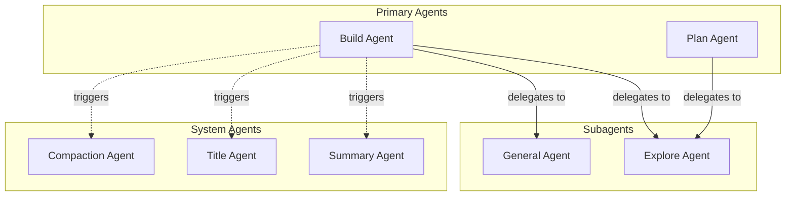

### Agent Definitions

#### Build Agent
- **Mode**: Primary
- **Purpose**: Main coding agent for implementing features and fixing bugs
- **Permissions**: Full tool access with question and plan_enter capabilities
- **Behavior**: Can delegate to subagents, manages todo lists, handles complex multi-step tasks

#### Plan Agent
- **Mode**: Primary
- **Purpose**: Planning and architecture design
- **Permissions**: Limited edit access to plan files only, question and plan_exit capabilities
- **Behavior**: Creates and manages plan documents, coordinates with explore agent for research

#### General Agent
- **Mode**: Subagent
- **Description**: General-purpose agent for researching complex questions and executing multi-step tasks
- **Permissions**: Standard tool access, no todo read/write
- **Behavior**: Executes parallel work units, handles research tasks

#### Explore Agent
- **Mode**: Subagent
- **Description**: Fast agent specialized for codebase exploration
- **Permissions**: Read-only tools (grep, glob, list, bash, read, webfetch, websearch, codesearch)
- **Behavior**: Quick file pattern matching, keyword searching, codebase analysis
- **Thoroughness Levels**: Quick, medium, or very thorough exploration modes

#### System Agents

- **Compaction Agent**: Summarizes conversation history to reduce context size
- **Title Agent**: Generates session titles from conversation content
- **Summary Agent**: Creates message summaries for display

### Permission System

The permission system in [`packages/opencode/src/permission/next.ts`](packages/opencode/src/permission/next.ts) implements granular access control:

#### Permission Types

| Permission | Description | Default Action |
|------------|-------------|----------------|
| bash | Shell command execution | Allow with patterns |
| read | File reading | Allow, ask for .env files |
| edit | File modification | Allow |
| external_directory | Access outside project | Ask |
| doom_loop | Repeated identical tool calls | Ask |
| task | Subagent delegation | Allow |
| question | User interaction | Deny by default |
| plan_enter | Enter planning mode | Deny by default |
| plan_exit | Exit planning mode | Deny by default |

#### Permission Evaluation Flow

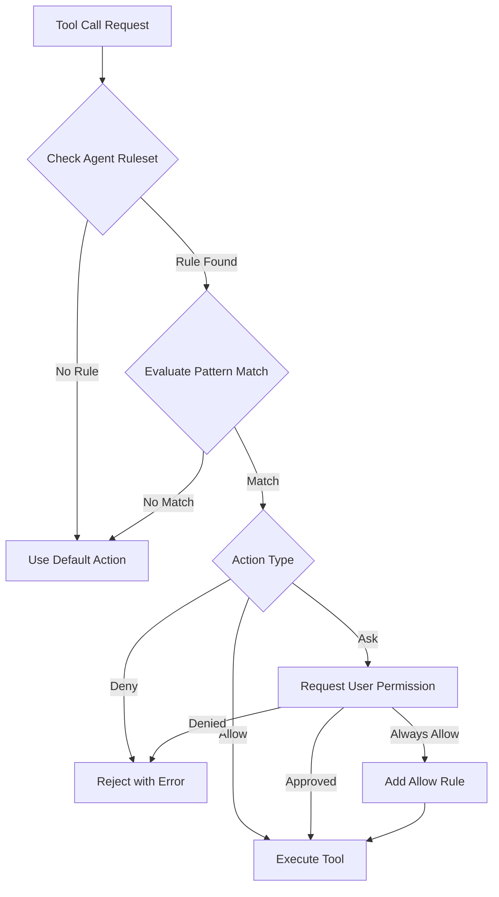

### Agent State Management

Agents maintain state through the session system, with each agent invocation creating or continuing a session context. State includes:

- **Message History**: Complete conversation with parts
- **Tool Call Results**: Outputs from executed tools
- **Snapshots**: Git-based file state tracking
- **Permissions**: Session-scoped permission rules
- **Todos**: Task lists for tracking work

### Inter-Agent Communication

Agents communicate through the task tool, which:
1. Creates child sessions with inherited permissions
2. Passes prompts to subagents
3. Collects and summarizes results
4. Maintains parent-child session relationships

---

## Workflow and Process Flow Documentation

### Session Lifecycle

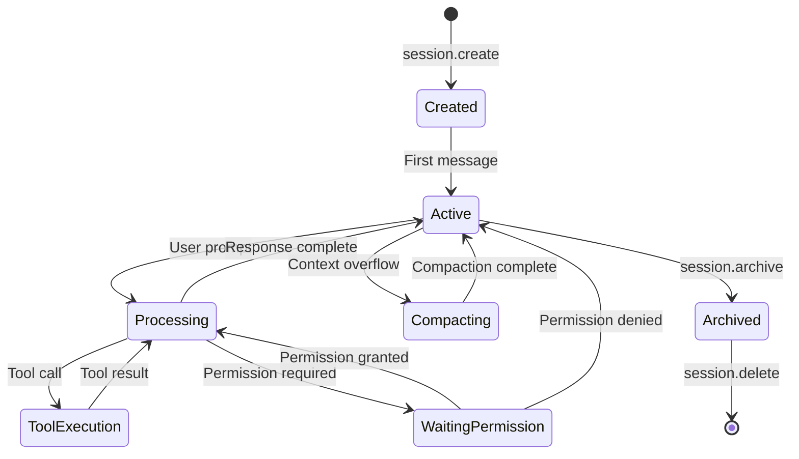

### Message Processing Pipeline

The message processing pipeline in [`packages/opencode/src/session/processor.ts`](packages/opencode/src/session/processor.ts) handles the complete lifecycle of AI interactions:

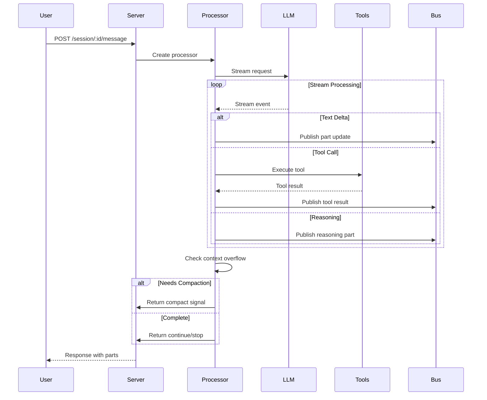

### Tool Execution Flow

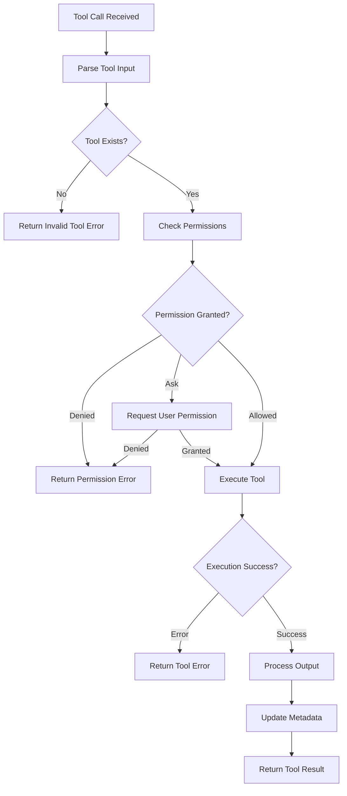

### Doom Loop Detection

The processor implements doom loop detection to prevent infinite tool call cycles:

1. Track last N tool calls (threshold: 3)
2. Compare tool name and input parameters
3. If all match, trigger doom_loop permission check
4. User can approve continuation or abort

### Retry Logic

The system implements exponential backoff retry for transient failures:

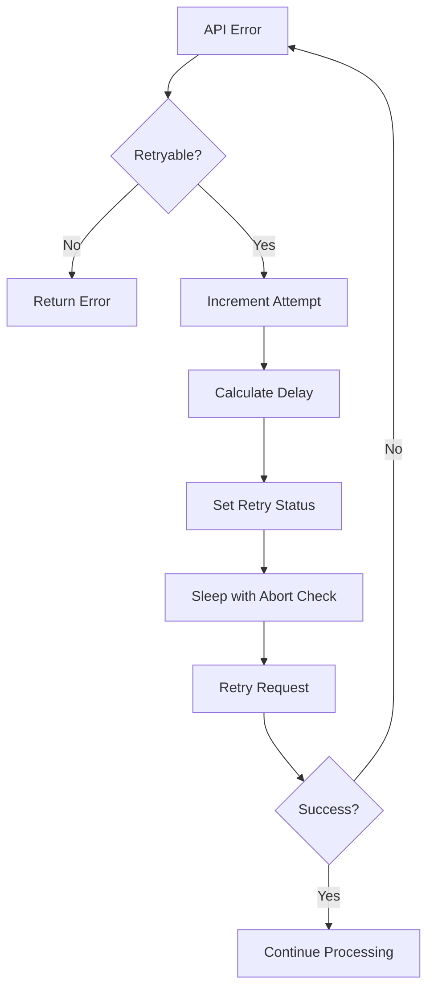

### Session Compaction

When context limits are approached, the compaction system:

1. Detects token overflow based on model limits
2. Creates compaction agent session
3. Summarizes conversation history
4. Replaces detailed history with summary
5. Continues with reduced context

---

## Data Flow Analysis

### Data Entry Points

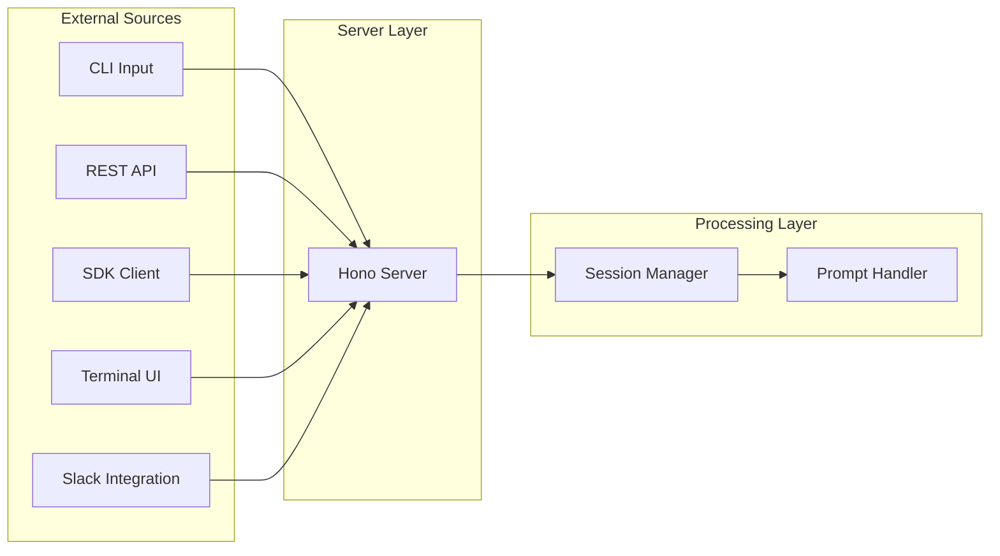

### Message Data Flow

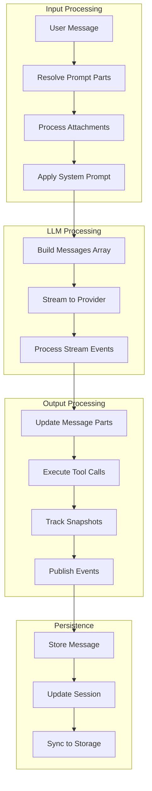

### Storage Architecture

The storage system in [`packages/opencode/src/storage/storage.ts`](packages/opencode/src/storage/storage.ts) implements JSON file-based persistence:

#### Storage Locations

| Data Type | Location | Format |
|-----------|----------|--------|
| Sessions | `~/.local/state/opencode/session/` | JSON files |
| Messages | `~/.local/state/opencode/message/` | JSON files |
| Parts | `~/.local/state/opencode/part/` | JSON files |
| Auth | `~/.local/state/opencode/auth/` | JSON files |
| Config | `~/.config/opencode/` | JSON files |

#### Data Migration System

The storage system supports schema migrations:
- Version tracking per entity type
- Automatic migration on load
- Backward compatibility maintenance

### Event Bus Architecture

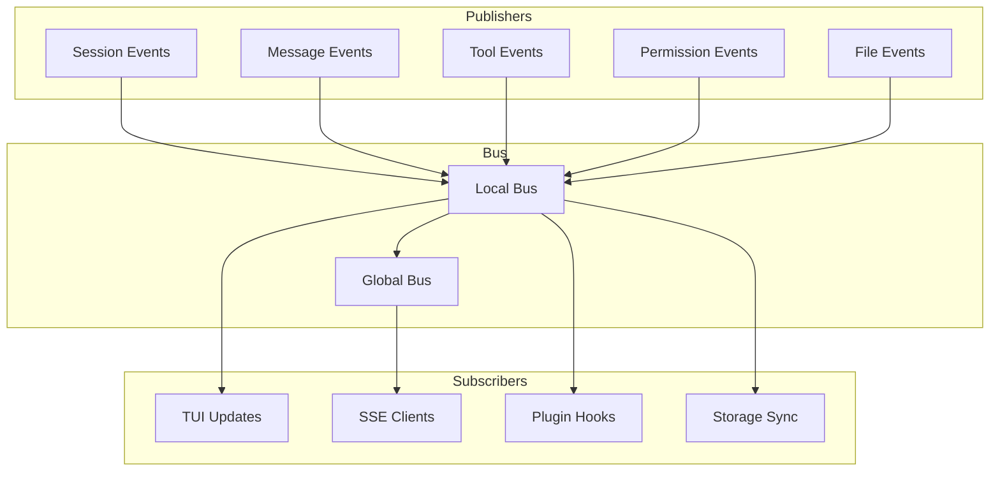

### Snapshot System

The snapshot system in [`packages/opencode/src/snapshot/index.ts`](packages/opencode/src/snapshot/index.ts) provides git-based file tracking:

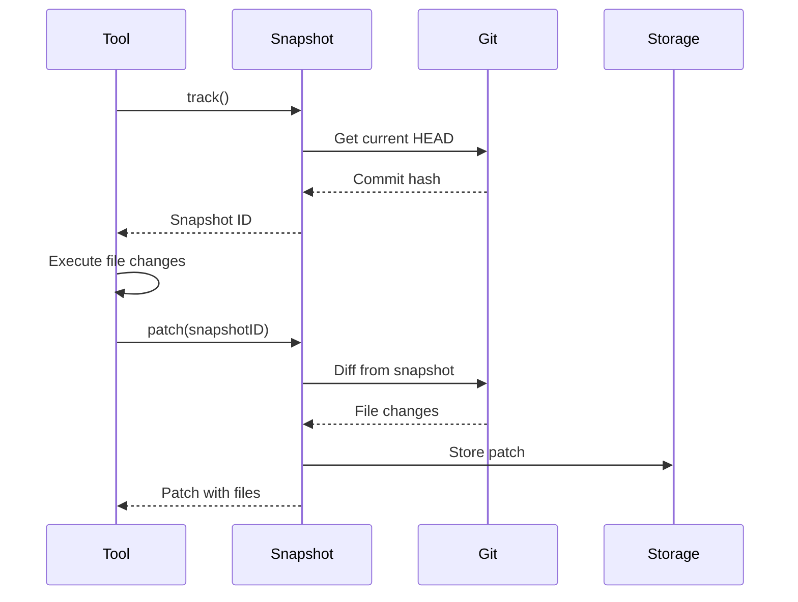

### Caching Mechanisms

The system implements several caching strategies:

1. **Provider SDK Caching**: SDK instances cached by configuration hash
2. **Model Language Caching**: Language model instances cached by provider/model key
3. **Configuration Caching**: Config loaded once per instance lifecycle
4. **Tool Definition Caching**: Tool schemas cached after first resolution

---

## Integration Points and External Dependencies

### External Service Integrations

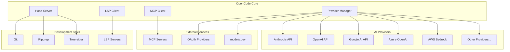

### API Dependencies

#### Runtime Dependencies

| Package | Purpose | Version |
|---------|---------|---------|
| ai | Vercel AI SDK core | catalog |
| hono | HTTP server framework | catalog |
| zod | Schema validation | catalog |
| solid-js | Reactive primitives | catalog |
| @modelcontextprotocol/sdk | MCP client | 1.25.2 |
| web-tree-sitter | Code parsing | 0.25.10 |
| diff | Text diffing | catalog |

#### Development Dependencies

| Package | Purpose |
|---------|---------|
| typescript | Type checking |
| bun | Runtime and bundler |
| @types/bun | Bun type definitions |

### Authentication Integrations

The system supports multiple authentication methods:

1. **API Key Authentication**: Direct API key storage and retrieval
2. **OAuth 2.0 Flows**: Full OAuth support with PKCE
3. **AWS Credential Chain**: IAM roles, profiles, web identity tokens
4. **Custom Auth Plugins**: Plugin-based authentication extensions

### Plugin System Integration

The plugin system in [`packages/plugin/src/index.ts`](packages/plugin/src/index.ts) provides extensibility through hooks:

#### Available Hooks

| Hook | Trigger | Purpose |
|------|---------|---------|
| event | Any bus event | React to system events |
| config | Config load | Modify configuration |
| tool | Tool registration | Add custom tools |
| auth | Provider auth | Custom authentication |
| chat.message | New message | Modify messages |
| chat.params | LLM call | Adjust model parameters |
| permission.ask | Permission check | Override permissions |
| tool.execute.before | Tool start | Pre-execution logic |
| tool.execute.after | Tool complete | Post-execution logic |

### SDK Client Integration

The SDK in [`packages/sdk/js/src/index.ts`](packages/sdk/js/src/index.ts) provides programmatic access:

```typescript
// SDK usage pattern
const { client, server } = await createOpencode()

// Session management
const session = await client.session.create()
const response = await client.session.prompt({
  sessionID: session.id,
  parts: [{ type: 'text', text: 'Hello' }]
})

// Event subscription
client.event.subscribe((event) => {
  console.log(event.type, event.properties)
})
```

---

## System Architecture Diagram

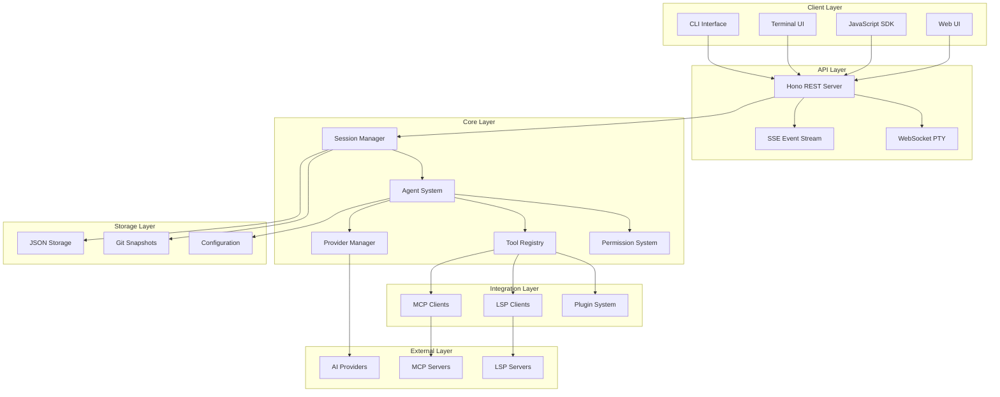

---

## Primary Workflow Sequence Diagram

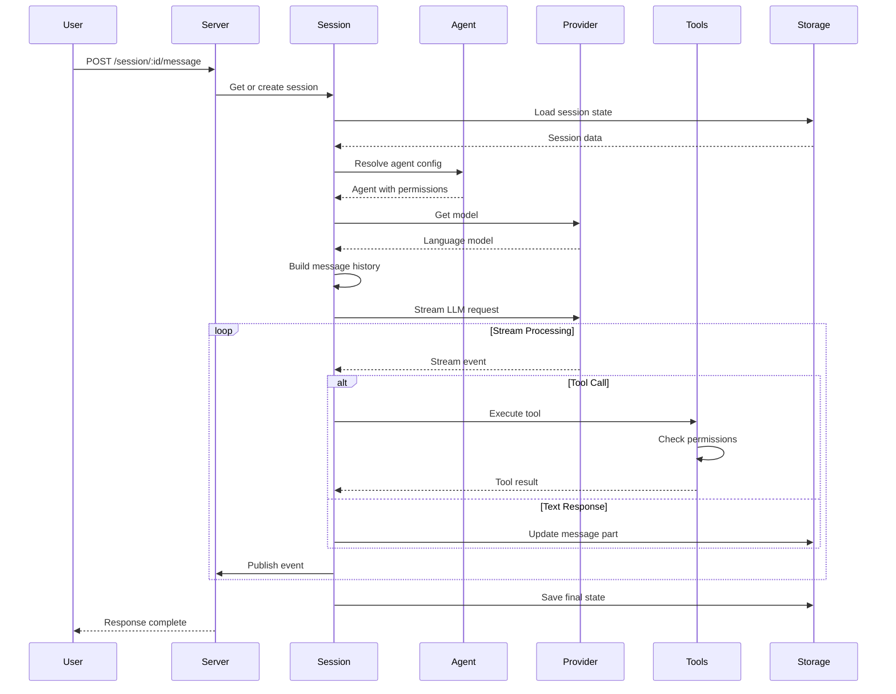

---

## Tool Execution Decision Flowchart

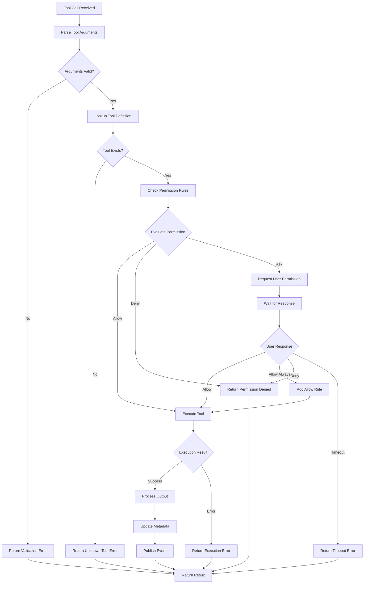

---

## Session State Diagram

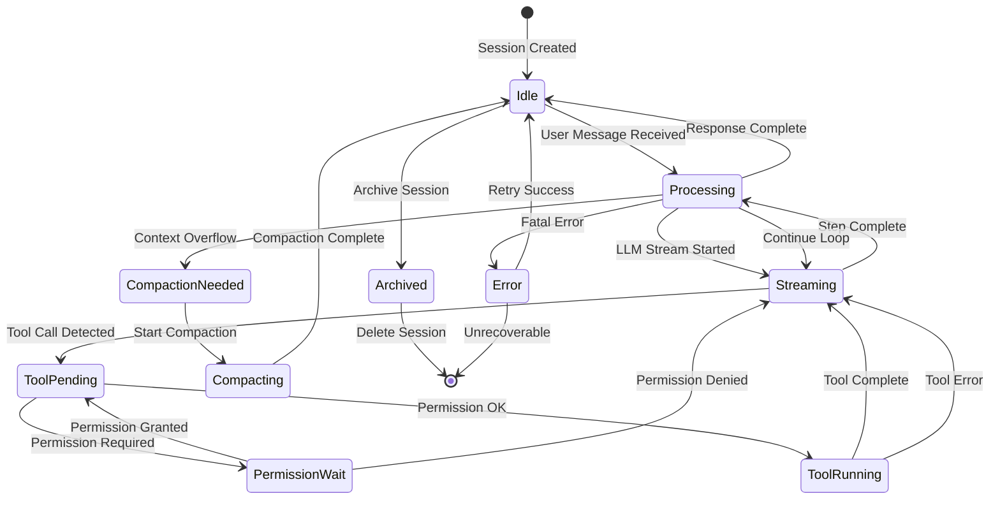

---

## Data Model Entity Relationship Diagram

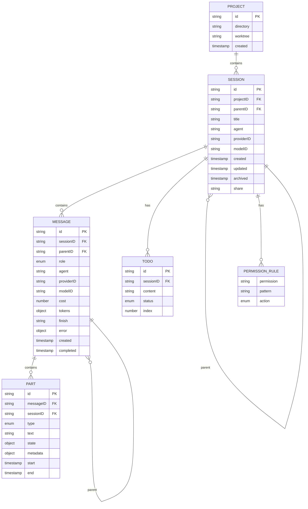

---

## Agent Interaction Sequence Diagram

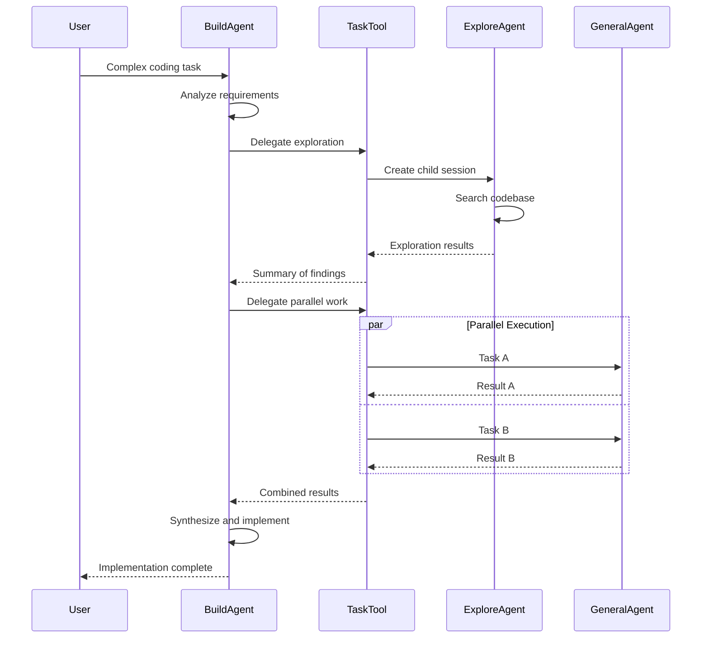

---

## Agent and System Prompts Inventory

This section documents all prompts used by OpenCode for agents, tools, and system operations.

### Agent Prompts

#### Compaction Agent Prompt
**Location**: [`packages/opencode/src/agent/prompt/compaction.txt`](packages/opencode/src/agent/prompt/compaction.txt)

The compaction agent summarizes conversations to reduce context size while preserving essential information:

- Focuses on what was done and what is being worked on
- Tracks which files are being modified
- Preserves key user requests, constraints, and preferences
- Documents important technical decisions and rationale
- Maintains information needed for conversation continuity

#### Explore Agent Prompt
**Location**: [`packages/opencode/src/agent/prompt/explore.txt`](packages/opencode/src/agent/prompt/explore.txt)

The explore agent is a file search specialist optimized for codebase navigation:

- Uses glob patterns for broad file matching
- Employs regex patterns for content searching
- Reads and analyzes file contents
- Adapts search approach based on thoroughness level (quick, medium, very thorough)
- Returns absolute file paths
- Read-only operations only - no file modifications

#### Summary Agent Prompt
**Location**: [`packages/opencode/src/agent/prompt/summary.txt`](packages/opencode/src/agent/prompt/summary.txt)

The summary agent creates pull request-style descriptions:

- Limited to 2-3 sentences maximum
- Describes changes made, not the process
- Written in first person (I added..., I fixed...)
- Preserves unanswered questions or imperative statements
- Excludes mentions of tests, builds, or validation steps

#### Title Agent Prompt
**Location**: [`packages/opencode/src/agent/prompt/title.txt`](packages/opencode/src/agent/prompt/title.txt)

The title agent generates conversation titles for retrieval:

- Single line, 50 characters or fewer
- Grammatically correct and natural reading
- Focuses on main topic or question
- Keeps technical terms, numbers, filenames exact
- Removes articles (the, this, my, a, an)
- Handles minimal input gracefully

#### Agent Generation Prompt
**Location**: [`packages/opencode/src/agent/generate.txt`](packages/opencode/src/agent/generate.txt)

Used to dynamically create new agent configurations:

- Extracts core intent from user descriptions
- Designs expert persona with domain knowledge
- Architects comprehensive system prompts
- Optimizes for performance with decision frameworks
- Creates concise, descriptive identifiers
- Outputs JSON with identifier, whenToUse, and systemPrompt

### Provider-Specific System Prompts

#### Anthropic System Prompt
**Location**: [`packages/opencode/src/session/prompt/anthropic.txt`](packages/opencode/src/session/prompt/anthropic.txt)

The primary system prompt for Anthropic Claude models:

- Establishes OpenCode as the best coding agent on the planet
- Emphasizes professional objectivity and technical accuracy
- Mandates extensive use of TodoWrite tool for task management
- Provides detailed examples for task planning
- Encourages parallel tool calls for efficiency
- Specifies code reference format (file_path:line_number)
- Restricts emoji usage unless requested

#### Codex System Prompt
**Location**: [`packages/opencode/src/session/prompt/codex.txt`](packages/opencode/src/session/prompt/codex.txt)

Comprehensive prompt for OpenAI Codex/GPT models:

- Defines personality as concise, direct, and friendly
- Specifies AGENTS.md file handling and scope rules
- Details preamble message guidelines for tool calls
- Provides extensive planning workflow with todowrite tool
- Covers sandbox and approval configurations
- Includes validation and testing philosophy
- Defines final answer structure and formatting guidelines

#### Gemini System Prompt
**Location**: [`packages/opencode/src/session/prompt/gemini.txt`](packages/opencode/src/session/prompt/gemini.txt)

Optimized prompt for Google Gemini models:

- Emphasizes core mandates for conventions and style
- Details primary workflows for software engineering tasks
- Includes new application development workflow
- Specifies security and safety rules
- Provides extensive examples for tone and workflow

#### Qwen System Prompt
**Location**: [`packages/opencode/src/session/prompt/qwen.txt`](packages/opencode/src/session/prompt/qwen.txt)

Minimalist prompt optimized for Qwen models:

- Emphasizes extreme conciseness (fewer than 4 lines)
- Provides one-word answer examples
- Focuses on direct, no-preamble responses
- Includes security warnings for malicious code
- Specifies code reference format

#### Beast Mode Prompt
**Location**: [`packages/opencode/src/session/prompt/beast.txt`](packages/opencode/src/session/prompt/beast.txt)

Aggressive autonomous agent prompt:

- Mandates continuous iteration until problem solved
- Requires extensive internet research via webfetch
- Emphasizes thorough testing and edge case handling
- Includes detailed workflow with 10 phases
- Specifies memory file management
- Casual, friendly communication style

#### GitHub Copilot GPT-5 Prompt
**Location**: [`packages/opencode/src/session/prompt/copilot-gpt-5.txt`](packages/opencode/src/session/prompt/copilot-gpt-5.txt)

Specialized prompt for GitHub Copilot integration:

- Expert AI programming assistant identity
- Structured workflow with 8 phases
- Code search instructions for workspace queries
- Tool use instructions with parallel execution
- Output formatting with Markdown and KaTeX support

### Mode-Specific Prompts

#### Plan Mode Prompt
**Location**: [`packages/opencode/src/session/prompt/plan.txt`](packages/opencode/src/session/prompt/plan.txt)

Read-only planning mode constraints:

- CRITICAL: Strictly forbids any file modifications
- Allows only observation, analysis, and planning
- Overrides all other instructions including user requests
- Encourages clarifying questions

#### Plan Mode Reminder for Anthropic
**Location**: [`packages/opencode/src/session/prompt/plan-reminder-anthropic.txt`](packages/opencode/src/session/prompt/plan-reminder-anthropic.txt)

Enhanced planning workflow for Anthropic models:

- Phase 1: Initial understanding with parallel Explore agents
- Phase 2: Planning with Plan subagent
- Phase 3: Synthesis and user questions
- Phase 4: Final plan documentation
- Phase 5: ExitPlanMode call

#### Build Switch Prompt
**Location**: [`packages/opencode/src/session/prompt/build-switch.txt`](packages/opencode/src/session/prompt/build-switch.txt)

Transition from plan to build mode:

- Announces mode change from plan to build
- Enables file changes and shell commands
- Unlocks full tool arsenal

#### Max Steps Prompt
**Location**: [`packages/opencode/src/session/prompt/max-steps.txt`](packages/opencode/src/session/prompt/max-steps.txt)

Step limit enforcement:

- Disables all tools when maximum steps reached
- Requires text-only response
- Mandates summary of work done
- Lists remaining incomplete tasks
- Provides recommendations for next steps

### Tool Description Prompts

#### Bash Tool
**Location**: [`packages/opencode/src/tool/bash.txt`](packages/opencode/src/tool/bash.txt)

Shell command execution guidelines:

- Workdir parameter for directory changes
- Specialized tools preferred over bash for file operations
- Git safety protocol with detailed commit workflow
- Pull request creation workflow
- Parallel command execution guidance

#### Edit Tool
**Location**: [`packages/opencode/src/tool/edit.txt`](packages/opencode/src/tool/edit.txt)

File modification instructions:

- Requires prior Read tool usage
- Exact indentation preservation
- Prefers editing over creating new files
- Error handling for not found and multiple matches
- replaceAll parameter for bulk replacements

#### Read Tool
**Location**: [`packages/opencode/src/tool/read.txt`](packages/opencode/src/tool/read.txt)

File reading capabilities:

- Absolute path requirement
- Default 2000 line limit with offset support
- Line number format (cat -n style)
- Batch reading encouragement
- Image file support

#### Grep Tool
**Location**: [`packages/opencode/src/tool/grep.txt`](packages/opencode/src/tool/grep.txt)

Content search functionality:

- Regular expression support
- File pattern filtering
- Results sorted by modification time
- Task tool recommendation for open-ended searches

#### Glob Tool
**Location**: [`packages/opencode/src/tool/glob.txt`](packages/opencode/src/tool/glob.txt)

File pattern matching:

- Glob pattern support using patterns like **/*.js and src/**/*.ts
- Results sorted by modification time
- Batch search encouragement

#### Task Tool
**Location**: [`packages/opencode/src/tool/task.txt`](packages/opencode/src/tool/task.txt)

Subagent delegation:

- Agent type selection via subagent_type parameter
- Concurrent agent launching for performance
- Stateless invocations unless session_id provided
- Detailed prompt requirements
- Usage examples with code-reviewer and greeting-responder

#### Question Tool
**Location**: [`packages/opencode/src/tool/question.txt`](packages/opencode/src/tool/question.txt)

User interaction during execution:

- Gathers preferences and requirements
- Clarifies ambiguous instructions
- Offers implementation choices
- Multiple selection support
- Recommended option placement

#### CodeSearch Tool
**Location**: [`packages/opencode/src/tool/codesearch.txt`](packages/opencode/src/tool/codesearch.txt)

Exa Code API integration:

- Programming task context retrieval
- Adjustable token count from 1000 to 50000
- Code examples, documentation, API references
- Framework, library, and API query support

#### List Tool
**Location**: [`packages/opencode/src/tool/ls.txt`](packages/opencode/src/tool/ls.txt)

Directory listing:

- Absolute path requirement
- Optional glob pattern ignore
- Glob and Grep tools preferred when possible

#### Plan Enter Tool
**Location**: [`packages/opencode/src/tool/plan-enter.txt`](packages/opencode/src/tool/plan-enter.txt)

Plan mode transition:

- Suggests switching for complex requests
- Required when user mentions planning
- Not for simple, straightforward tasks

#### Plan Exit Tool
**Location**: [`packages/opencode/src/tool/plan-exit.txt`](packages/opencode/src/tool/plan-exit.txt)

Build mode transition:

- Called after plan completion
- Requires clarified questions
- Confirms plan readiness

#### TodoWrite Tool
**Location**: [`packages/opencode/src/tool/todowrite.txt`](packages/opencode/src/tool/todowrite.txt)

Task management tool:

- Creates and updates todo lists for tracking work
- Supports pending, in-progress, and completed states
- Enables step-by-step task tracking
- Allows dynamic addition of discovered tasks

### Command Templates

#### Initialize Command
**Location**: [`packages/opencode/src/command/template/initialize.txt`](packages/opencode/src/command/template/initialize.txt)

AGENTS.md file creation:

- Build/lint/test commands
- Code style guidelines
- Approximately 150 lines target length
- Incorporates Cursor and Copilot rules

#### Review Command
**Location**: [`packages/opencode/src/command/template/review.txt`](packages/opencode/src/command/template/review.txt)

Code review workflow:

- Supports uncommitted changes, commits, branches, PRs
- Emphasizes full file context reading
- Bug detection as primary focus
- Structure and performance secondary
- Certainty requirement before flagging issues
- Explore agent, Exa Code Context, and Exa Web Search tools

---

## Conclusion

OpenCode represents a sophisticated architecture for AI-assisted software development, combining:

- **Flexible Provider Integration**: Supporting 20+ AI providers through a unified interface
- **Specialized Agent System**: Task-specific agents with granular permission control
- **Robust Tool Ecosystem**: Comprehensive development tools with safety mechanisms
- **Event-Driven Architecture**: Real-time updates through publish-subscribe patterns
- **Extensible Plugin System**: Hook-based customization for authentication, tools, and events
- **Persistent State Management**: JSON-based storage with migration support
- **Git-Integrated Snapshots**: File change tracking for undo/redo capabilities

The system's modular design enables easy extension and customization while maintaining security through its permission system and providing reliability through retry logic and error handling mechanisms.
