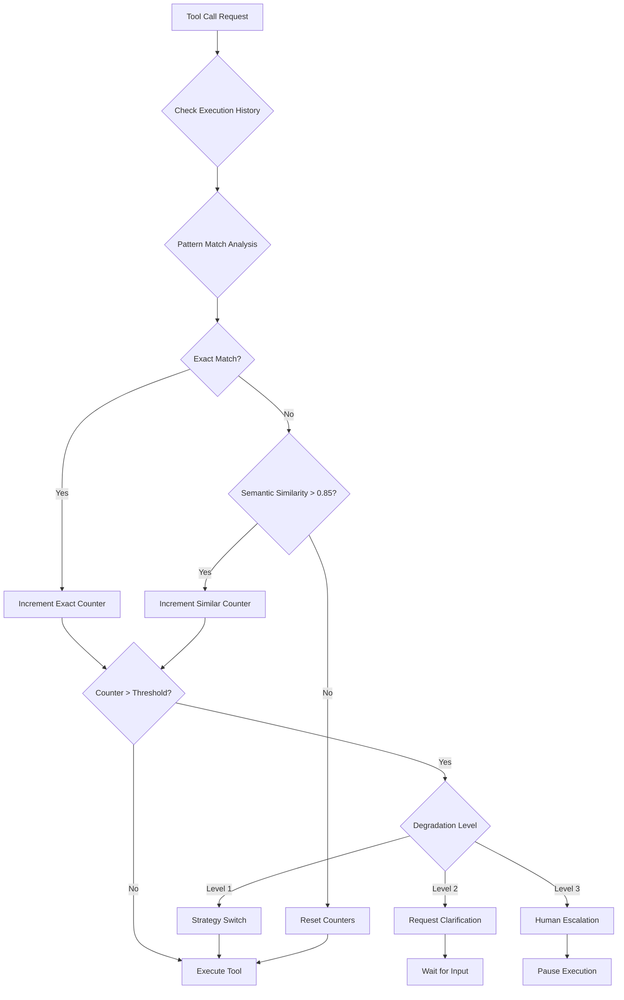
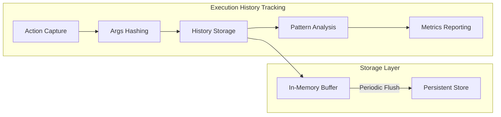
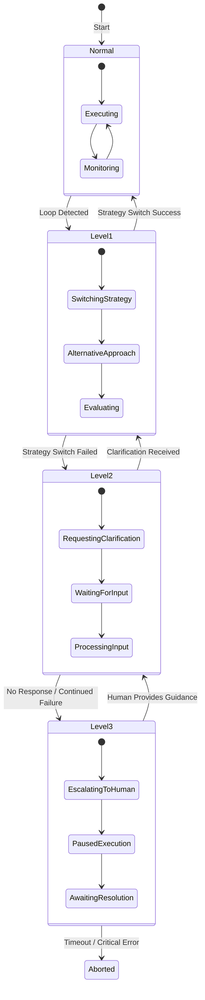
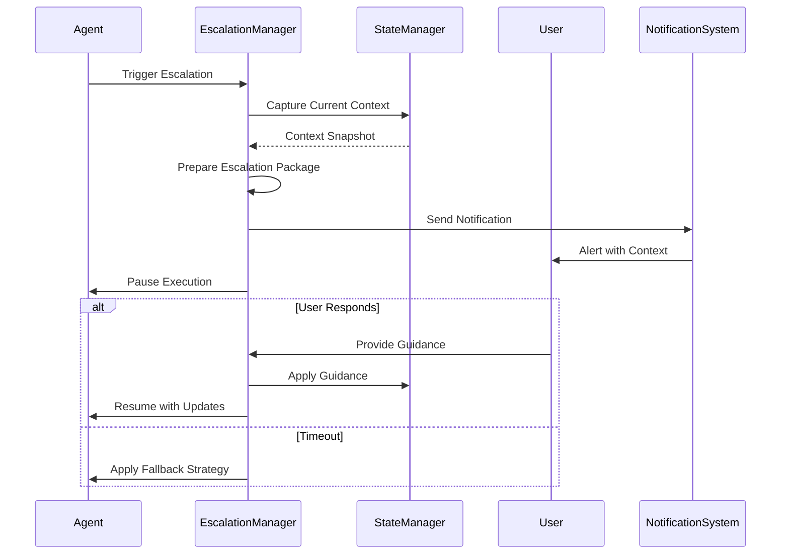

# Enhanced Agent Architecture Plan

## Progress Tracking Checklist

### Phase 1: Foundation (Core Infrastructure)
- [x] **1.1** Create loop prevention utility module structure
  - Set up `apps/open-swe/src/utils/loop-prevention/` directory
  - Implement base types and interfaces
  - Create execution history manager
- [x] **1.2** Extend state schema
  - Add `LoopDetectionState` to `GraphAnnotation`
  - Add configuration options to `GraphConfiguration`
  - Implement state reducers
- [x] **1.3** Implement basic cycle detection
  - Exact match detection
  - Tool-specific error counting
  - Basic threshold checking

### Phase 2: Detection & Analysis
- [x] **2.1** Implement semantic similarity analysis
  - Args hashing and comparison
  - Similarity scoring algorithm
  - Pattern cycle detection
- [x] **2.2** Create execution history tracking
  - History capture in `takeAction` node
  - Sliding window management
  - Pattern analysis utilities
- [x] **2.3** Implement threshold configuration system
  - Configuration schema
  - UI integration for settings
  - Per-tool override support

### Phase 3: Response & Recovery
- [x] **3.1** Implement degradation manager
  - Level calculation logic
  - Strategy switching implementation
  - Clarification request mechanism
- [x] **3.2** Create escalation manager
  - Human escalation flow
  - Context preservation
  - Fallback strategies
- [x] **3.3** Implement self-healing mechanisms
  - Recovery strategy registry
  - Automatic recovery attempts
  - Health monitoring

### Phase 4: Advanced Features
- [x] **4.1** Implement checkpoint system
  - Checkpoint creation and storage
  - State restoration
  - Git integration for file state
- [x] **4.2** Enhance task decomposition
  - Complexity analyzer
  - Dynamic task splitting
  - LLM-assisted breakdown
- [x] **4.3** Implement proactive error prevention
  - Pre-execution checks
  - Learned pattern matching
  - Suggestion generation

### Phase 5: Integration & Testing
- [x] **5.1** Integrate with existing graphs
  - Update `takeAction` node
  - Update `routeGeneratedAction` conditional edge
  - Add new routing options
- [x] **5.2** Create comprehensive tests
  - Unit tests for all new utilities
  - Integration tests for loop detection
  - End-to-end tests for degradation flow
- [ ] **5.3** Documentation and configuration
  - Update AGENTS.md
  - Create configuration documentation
  - Add UI tooltips and help text

---

## Executive Summary

This document outlines a comprehensive plan to enhance the open-swe AI agent architecture based on patterns extracted from the Kilo Code and OpenCode example implementations. The improvements focus on creating more robust agents with extended autonomous operation capabilities, sophisticated state management, intelligent task decomposition, self-correction mechanisms, and comprehensive loop prevention systems.

---

## Analysis of Example Architectures

### Key Patterns from Kilo Code

1. **Mode System Architecture**: Specialized operational modes (Code, Architect, Debug, Ask, Orchestrator) with distinct tool permissions and role definitions
2. **Checkpoint System**: Git-based shadow repository for workspace state versioning with rollback capabilities
3. **Loop Prevention Mechanisms**:
   - Consecutive mistake counter per-file and per-tool
   - Error threshold detection (75% error rate triggers intervention)
   - Strategy switching on repeated failures
   - User intervention escalation
4. **YOLO Mode with AI Safety Gatekeeper**: Secondary AI model reviews actions before execution
5. **Memory Bank Pattern**: Structured project context files maintained across sessions
6. **Auto-Approval Decision Flow**: Multi-layered permission system with configurable thresholds

### Key Patterns from OpenCode

1. **Agent Type Hierarchy**: Primary agents (Build, Plan) delegate to subagents (General, Explore) with system agents for maintenance tasks
2. **Permission System**: Granular access control with doom_loop detection for repeated identical tool calls
3. **Session Compaction**: Automatic context summarization when token limits approach
4. **Retry Logic**: Exponential backoff with abort signal support
5. **Snapshot System**: Git-based file tracking for undo/redo capabilities
6. **Todo Management**: Session-scoped task tracking with status management

---

## Current open-swe Architecture Assessment

### Existing Strengths

1. **Multi-Graph Architecture**: Manager → Planner → Programmer → Reviewer pipeline
2. **Error Diagnosis**: [`shouldDiagnoseError()`](apps/open-swe/src/utils/tool-message-error.ts:117) triggers after 3 consecutive tool groups with ≥75% error rates
3. **History Summarization**: [`summarizeHistory()`](apps/open-swe/src/graphs/programmer/nodes/summarize-history.ts:148) compacts conversation when approaching 80k tokens
4. **Task Plan Management**: Structured [`TaskPlan`](packages/shared/src/open-swe/types.ts:131) with revisions and completion tracking
5. **Conditional Routing**: [`routeGeneratedAction()`](apps/open-swe/src/graphs/programmer/index.ts:46) handles multiple execution paths

### Identified Gaps

| Gap Area | Current State | Target State |
|----------|---------------|--------------|
| **Loop Detection** | Only error-rate based (75% threshold) | Multi-dimensional cycle detection with pattern matching |
| **Execution History** | No persistent tracking of action patterns | Full execution history with similarity analysis |
| **Repetition Thresholds** | Hardcoded values | Configurable per-tool and per-context limits |
| **Graceful Degradation** | Binary (continue/diagnose) | Progressive degradation with fallback strategies |
| **Human Escalation** | Only `request_human_help` tool | Structured escalation paths with context preservation |
| **Autonomous Operation** | Limited by error accumulation | Extended operation with self-healing capabilities |
| **State Management** | Basic message history | Rich execution context with checkpoints |

---

## Proposed Enhancements

### 1. Comprehensive Loop Prevention System

#### 1.1 Cycle Detection Algorithm



#### 1.2 Implementation Components

**New State Fields** (add to [`GraphAnnotation`](packages/shared/src/open-swe/types.ts:157)):

```typescript
// packages/shared/src/open-swe/types.ts

export interface ExecutionHistoryEntry {
  toolName: string;
  toolArgs: Record<string, unknown>;
  argsHash: string;
  timestamp: number;
  result: "success" | "error";
  errorType?: string;
}

export interface LoopDetectionState {
  executionHistory: ExecutionHistoryEntry[];
  consecutiveErrorCount: number;
  toolSpecificErrorCounts: Record<string, number>;
  similarActionCount: number;
  lastStrategySwitch: number;
  degradationLevel: 0 | 1 | 2 | 3;
}

// Add to GraphAnnotation
loopDetectionState: withLangGraph(z.custom<LoopDetectionState>(), {
  reducer: {
    schema: z.custom<LoopDetectionState>(),
    fn: loopDetectionReducer,
  },
  default: () => ({
    executionHistory: [],
    consecutiveErrorCount: 0,
    toolSpecificErrorCounts: {},
    similarActionCount: 0,
    lastStrategySwitch: 0,
    degradationLevel: 0,
  }),
}),
```

**New Utility Module** (`apps/open-swe/src/utils/loop-prevention/`):

```
loop-prevention/
├── index.ts                    # Main exports
├── cycle-detector.ts           # Pattern matching and cycle detection
├── execution-history.ts        # History tracking and analysis
├── similarity-analyzer.ts      # Semantic similarity for tool args
├── degradation-manager.ts      # Progressive degradation logic
├── thresholds.ts              # Configurable threshold definitions
└── types.ts                   # Type definitions
```

#### 1.3 Cycle Detection Logic

```typescript
// apps/open-swe/src/utils/loop-prevention/cycle-detector.ts

export interface CycleDetectionResult {
  isLoop: boolean;
  loopType: "exact" | "semantic" | "pattern" | null;
  confidence: number;
  suggestedAction: "continue" | "switch-strategy" | "clarify" | "escalate";
  matchedEntries: ExecutionHistoryEntry[];
}

export function detectCycle(
  currentAction: { toolName: string; toolArgs: Record<string, unknown> },
  history: ExecutionHistoryEntry[],
  config: LoopDetectionConfig,
): CycleDetectionResult {
  // 1. Check for exact matches (same tool + same args hash)
  const exactMatches = findExactMatches(currentAction, history, config.lookbackWindow);
  
  // 2. Check for semantic similarity (same tool + similar args)
  const semanticMatches = findSemanticMatches(currentAction, history, config.similarityThreshold);
  
  // 3. Check for pattern cycles (A→B→C→A sequences)
  const patternCycles = detectPatternCycles(history, config.patternLength);
  
  // 4. Determine suggested action based on findings
  return evaluateAndSuggest(exactMatches, semanticMatches, patternCycles, config);
}
```

### 2. Execution History Tracking System

#### 2.1 Architecture



#### 2.2 Implementation

```typescript
// apps/open-swe/src/utils/loop-prevention/execution-history.ts

export class ExecutionHistoryManager {
  private readonly maxHistorySize: number;
  private readonly persistenceInterval: number;
  
  constructor(config: ExecutionHistoryConfig) {
    this.maxHistorySize = config.maxHistorySize ?? 1000;
    this.persistenceInterval = config.persistenceInterval ?? 100;
  }
  
  addEntry(entry: Omit<ExecutionHistoryEntry, "argsHash" | "timestamp">): ExecutionHistoryEntry {
    const fullEntry: ExecutionHistoryEntry = {
      ...entry,
      argsHash: this.hashArgs(entry.toolArgs),
      timestamp: Date.now(),
    };
    
    // Maintain sliding window
    if (this.history.length >= this.maxHistorySize) {
      this.history = this.history.slice(-Math.floor(this.maxHistorySize * 0.8));
    }
    
    this.history.push(fullEntry);
    return fullEntry;
  }
  
  getRecentHistory(count: number): ExecutionHistoryEntry[] {
    return this.history.slice(-count);
  }
  
  getToolSpecificHistory(toolName: string, count?: number): ExecutionHistoryEntry[] {
    const filtered = this.history.filter(e => e.toolName === toolName);
    return count ? filtered.slice(-count) : filtered;
  }
  
  analyzePatterns(): PatternAnalysisResult {
    return {
      mostFrequentTools: this.getMostFrequentTools(),
      errorRateByTool: this.calculateErrorRateByTool(),
      detectedCycles: this.findCyclicPatterns(),
      averageTimeBetweenActions: this.calculateAverageActionInterval(),
    };
  }
}
```

### 3. Repetition Threshold Configuration System

#### 3.1 Configuration Schema

```typescript
// packages/shared/src/open-swe/loop-prevention-config.ts

export interface LoopPreventionConfig {
  // Global settings
  enabled: boolean;
  
  // Exact match thresholds
  exactMatchThreshold: number;           // Default: 3
  exactMatchLookbackWindow: number;      // Default: 50 actions
  
  // Semantic similarity settings
  semanticSimilarityEnabled: boolean;    // Default: true
  semanticSimilarityThreshold: number;   // Default: 0.85
  semanticMatchThreshold: number;        // Default: 5
  
  // Pattern detection
  patternDetectionEnabled: boolean;      // Default: true
  minPatternLength: number;              // Default: 2
  maxPatternLength: number;              // Default: 5
  patternRepetitionThreshold: number;    // Default: 2
  
  // Tool-specific overrides
  toolSpecificConfig: Record<string, ToolLoopConfig>;
  
  // Degradation settings
  degradationLevels: DegradationLevelConfig[];
  
  // Escalation settings
  autoEscalationEnabled: boolean;        // Default: true
  escalationCooldownMs: number;          // Default: 300000 (5 minutes)
}

export interface ToolLoopConfig {
  exactMatchThreshold?: number;
  semanticMatchThreshold?: number;
  allowedConsecutiveErrors?: number;
  customDegradationStrategy?: string;
}

export interface DegradationLevelConfig {
  level: number;
  triggerCondition: string;
  action: "switch-strategy" | "request-clarification" | "escalate" | "abort";
  cooldownMs: number;
}
```

#### 3.2 Configuration Integration

Add to [`GraphConfiguration`](packages/shared/src/open-swe/types.ts:506):

```typescript
// Add to GraphConfiguration schema
loopPreventionConfig: withLangGraph(z.string().optional(), {
  metadata: {
    x_open_swe_ui_config: {
      type: "json",
      default: JSON.stringify(DEFAULT_LOOP_PREVENTION_CONFIG),
      description: "JSON configuration for loop prevention system. Controls thresholds, degradation levels, and escalation behavior.",
    },
  },
}),
```

### 4. Graceful Degradation Strategies

#### 4.1 Degradation Level Flow



#### 4.2 Degradation Manager Implementation

```typescript
// apps/open-swe/src/utils/loop-prevention/degradation-manager.ts

export class DegradationManager {
  private currentLevel: DegradationLevel = 0;
  private levelHistory: DegradationEvent[] = [];
  
  async handleLoopDetection(
    detection: CycleDetectionResult,
    state: GraphState,
    config: GraphConfig,
  ): Promise<DegradationResponse> {
    const newLevel = this.calculateNewLevel(detection);
    
    if (newLevel > this.currentLevel) {
      this.currentLevel = newLevel;
      this.levelHistory.push({
        level: newLevel,
        timestamp: Date.now(),
        trigger: detection,
      });
    }
    
    switch (this.currentLevel) {
      case 0:
        return { action: "continue", stateUpdate: null };
        
      case 1:
        return this.executeStrategySwitch(detection, state, config);
        
      case 2:
        return this.requestClarification(detection, state, config);
        
      case 3:
        return this.escalateToHuman(detection, state, config);
        
      default:
        return { action: "abort", reason: "Unknown degradation level" };
    }
  }
  
  private async executeStrategySwitch(
    detection: CycleDetectionResult,
    state: GraphState,
    config: GraphConfig,
  ): Promise<DegradationResponse> {
    const strategies = this.getAlternativeStrategies(detection.matchedEntries);
    
    if (strategies.length === 0) {
      // No alternative strategies available, escalate
      this.currentLevel = 2;
      return this.requestClarification(detection, state, config);
    }
    
    return {
      action: "switch-strategy",
      strategy: strategies[0],
      stateUpdate: {
        loopDetectionState: {
          ...state.loopDetectionState,
          lastStrategySwitch: Date.now(),
          degradationLevel: 1,
        },
      },
    };
  }
  
  private getAlternativeStrategies(
    failedActions: ExecutionHistoryEntry[],
  ): AlternativeStrategy[] {
    // Analyze failed actions and suggest alternatives
    const toolName = failedActions[0]?.toolName;
    
    const strategyMap: Record<string, AlternativeStrategy[]> = {
      shell: [
        { type: "use-alternative-command", description: "Try equivalent command with different flags" },
        { type: "break-into-steps", description: "Split complex command into simpler steps" },
      ],
      text_editor: [
        { type: "use-apply-patch", description: "Switch to apply_patch tool for file modifications" },
        { type: "read-first", description: "Re-read file content before editing" },
      ],
      apply_patch: [
        { type: "use-text-editor", description: "Switch to text_editor for precise edits" },
        { type: "smaller-patches", description: "Apply changes in smaller increments" },
      ],
      grep: [
        { type: "broaden-search", description: "Use less specific search patterns" },
        { type: "use-glob-first", description: "Find files with glob, then search content" },
      ],
    };
    
    return strategyMap[toolName] ?? [];
  }
}
```

### 5. Human Escalation Paths

#### 5.1 Escalation Flow



#### 5.2 Escalation Manager Implementation

```typescript
// apps/open-swe/src/utils/loop-prevention/escalation-manager.ts

export interface EscalationContext {
  reason: string;
  loopDetection: CycleDetectionResult;
  recentHistory: ExecutionHistoryEntry[];
  currentTask: PlanItem;
  suggestedActions: string[];
  stateSnapshot: Partial<GraphState>;
}

export interface EscalationResponse {
  action: "continue" | "abort" | "modify-plan" | "skip-task";
  guidance?: string;
  modifiedPlan?: PlanItem[];
}

export class EscalationManager {
  async escalate(
    context: EscalationContext,
    state: GraphState,
    config: GraphConfig,
  ): Promise<EscalationResponse> {
    // Create human-readable escalation message
    const escalationMessage = this.formatEscalationMessage(context);
    
    // Use interrupt mechanism for human input
    const humanResponse = await this.requestHumanInput(escalationMessage, state, config);
    
    if (!humanResponse) {
      // Timeout - apply fallback
      return this.applyFallbackStrategy(context, state);
    }
    
    return this.processHumanResponse(humanResponse, context);
  }
  
  private formatEscalationMessage(context: EscalationContext): string {
    return `
## Agent Requires Assistance

### Issue
${context.reason}

### Current Task
${context.currentTask.plan}

### Recent Actions (Last 5)
${context.recentHistory.slice(-5).map(e => `- ${e.toolName}: ${e.result}`).join('\n')}

### Detected Pattern
${context.loopDetection.loopType} loop with ${context.loopDetection.confidence * 100}% confidence

### Suggested Actions
${context.suggestedActions.map((a, i) => `${i + 1}. ${a}`).join('\n')}

Please provide guidance on how to proceed.
    `.trim();
  }
  
  private async requestHumanInput(
    message: string,
    state: GraphState,
    config: GraphConfig,
  ): Promise<string | null> {
    // Implementation depends on the interrupt mechanism
    // This integrates with LangGraph's interrupt functionality
    return null; // Placeholder
  }
  
  private applyFallbackStrategy(
    context: EscalationContext,
    state: GraphState,
  ): EscalationResponse {
    // Default fallback: skip current task and move to next
    return {
      action: "skip-task",
      guidance: "Automatically skipped due to unresolved loop. Manual review recommended.",
    };
  }
}
```

### 6. Extended Autonomous Operation Capabilities

#### 6.1 Self-Healing Mechanisms

```typescript
// apps/open-swe/src/utils/autonomous/self-healing.ts

export interface SelfHealingConfig {
  enabled: boolean;
  maxAutoRecoveryAttempts: number;
  recoveryStrategies: RecoveryStrategy[];
  healthCheckInterval: number;
}

export interface RecoveryStrategy {
  name: string;
  applicableTo: string[];  // Tool names or error types
  execute: (context: RecoveryContext) => Promise<RecoveryResult>;
}

export class SelfHealingManager {
  private recoveryAttempts: Map<string, number> = new Map();
  
  async attemptRecovery(
    error: ToolExecutionError,
    state: GraphState,
    config: GraphConfig,
  ): Promise<RecoveryResult> {
    const errorKey = this.getErrorKey(error);
    const attempts = this.recoveryAttempts.get(errorKey) ?? 0;
    
    if (attempts >= this.config.maxAutoRecoveryAttempts) {
      return { success: false, reason: "Max recovery attempts exceeded" };
    }
    
    const strategy = this.selectRecoveryStrategy(error);
    if (!strategy) {
      return { success: false, reason: "No applicable recovery strategy" };
    }
    
    this.recoveryAttempts.set(errorKey, attempts + 1);
    
    return strategy.execute({
      error,
      state,
      config,
      attemptNumber: attempts + 1,
    });
  }
  
  private selectRecoveryStrategy(error: ToolExecutionError): RecoveryStrategy | null {
    return this.config.recoveryStrategies.find(
      s => s.applicableTo.includes(error.toolName) || s.applicableTo.includes(error.type)
    ) ?? null;
  }
}

// Built-in recovery strategies
export const DEFAULT_RECOVERY_STRATEGIES: RecoveryStrategy[] = [
  {
    name: "sandbox-reconnect",
    applicableTo: ["sandbox-connection-error", "sandbox-timeout"],
    execute: async (ctx) => {
      // Attempt to reconnect to sandbox
      return { success: true, action: "reconnected" };
    },
  },
  {
    name: "file-refresh",
    applicableTo: ["text_editor", "apply_patch"],
    execute: async (ctx) => {
      // Re-read file before retrying edit
      return { success: true, action: "file-refreshed" };
    },
  },
  {
    name: "command-retry-with-timeout",
    applicableTo: ["shell"],
    execute: async (ctx) => {
      // Retry command with extended timeout
      return { success: true, action: "retried-with-timeout" };
    },
  },
];
```

#### 6.2 Autonomous Operation Limits

```typescript
// apps/open-swe/src/utils/autonomous/operation-limits.ts

export interface AutonomousOperationLimits {
  maxTotalActions: number;           // Default: 500
  maxActionsPerTask: number;         // Default: 100
  maxConsecutiveErrors: number;      // Default: 10
  maxExecutionTimeMs: number;        // Default: 3600000 (1 hour)
  maxTokensPerSession: number;       // Default: 500000
  checkpointInterval: number;        // Default: 25 actions
}

export class OperationLimitsManager {
  private actionCount: number = 0;
  private taskActionCounts: Map<string, number> = new Map();
  private startTime: number = Date.now();
  private totalTokens: number = 0;
  
  checkLimits(state: GraphState, config: GraphConfig): LimitCheckResult {
    const limits = this.getLimits(config);
    
    const checks: LimitCheck[] = [
      {
        name: "total-actions",
        current: this.actionCount,
        limit: limits.maxTotalActions,
        exceeded: this.actionCount >= limits.maxTotalActions,
      },
      {
        name: "execution-time",
        current: Date.now() - this.startTime,
        limit: limits.maxExecutionTimeMs,
        exceeded: Date.now() - this.startTime >= limits.maxExecutionTimeMs,
      },
      {
        name: "consecutive-errors",
        current: state.loopDetectionState?.consecutiveErrorCount ?? 0,
        limit: limits.maxConsecutiveErrors,
        exceeded: (state.loopDetectionState?.consecutiveErrorCount ?? 0) >= limits.maxConsecutiveErrors,
      },
    ];
    
    const exceededLimits = checks.filter(c => c.exceeded);
    
    return {
      canContinue: exceededLimits.length === 0,
      exceededLimits,
      shouldCheckpoint: this.actionCount % limits.checkpointInterval === 0,
    };
  }
}
```

### 7. Sophisticated State Management Enhancements

#### 7.1 Enhanced State Schema

```typescript
// packages/shared/src/open-swe/enhanced-state.ts

export interface ExecutionCheckpoint {
  id: string;
  timestamp: number;
  actionIndex: number;
  stateSnapshot: {
    taskPlan: TaskPlan;
    branchName: string;
    completedActions: number;
    loopDetectionState: LoopDetectionState;
  };
  gitCommitHash?: string;
  description: string;
}

export interface EnhancedGraphState extends GraphState {
  // Execution tracking
  loopDetectionState: LoopDetectionState;
  executionCheckpoints: ExecutionCheckpoint[];
  currentCheckpointId: string | null;
  
  // Autonomous operation tracking
  autonomousOperationMetrics: {
    totalActions: number;
    successfulActions: number;
    failedActions: number;
    recoveredErrors: number;
    strategySwtiches: number;
    humanEscalations: number;
  };
  
  // Context preservation
  longTermContext: {
    keyInsights: string[];
    importantFiles: string[];
    learnedPatterns: string[];
    avoidedApproaches: string[];
  };
}
```

#### 7.2 Checkpoint Management

```typescript
// apps/open-swe/src/utils/state/checkpoint-manager.ts

export class CheckpointManager {
  private checkpoints: ExecutionCheckpoint[] = [];
  private maxCheckpoints: number = 20;
  
  async createCheckpoint(
    state: GraphState,
    config: GraphConfig,
    description: string,
  ): Promise<ExecutionCheckpoint> {
    const checkpoint: ExecutionCheckpoint = {
      id: uuidv4(),
      timestamp: Date.now(),
      actionIndex: state.autonomousOperationMetrics?.totalActions ?? 0,
      stateSnapshot: {
        taskPlan: state.taskPlan,
        branchName: state.branchName,
        completedActions: state.autonomousOperationMetrics?.totalActions ?? 0,
        loopDetectionState: state.loopDetectionState,
      },
      description,
    };
    
    // Optionally create git commit for file state
    if (!isLocalMode(config)) {
      checkpoint.gitCommitHash = await this.createGitCheckpoint(state, config);
    }
    
    this.checkpoints.push(checkpoint);
    
    // Maintain max checkpoints
    if (this.checkpoints.length > this.maxCheckpoints) {
      this.checkpoints = this.checkpoints.slice(-this.maxCheckpoints);
    }
    
    return checkpoint;
  }
  
  async restoreCheckpoint(
    checkpointId: string,
    state: GraphState,
    config: GraphConfig,
  ): Promise<Partial<GraphState>> {
    const checkpoint = this.checkpoints.find(c => c.id === checkpointId);
    if (!checkpoint) {
      throw new Error(`Checkpoint ${checkpointId} not found`);
    }
    
    // Restore git state if available
    if (checkpoint.gitCommitHash && !isLocalMode(config)) {
      await this.restoreGitState(checkpoint.gitCommitHash, state, config);
    }
    
    return {
      taskPlan: checkpoint.stateSnapshot.taskPlan,
      loopDetectionState: checkpoint.stateSnapshot.loopDetectionState,
      currentCheckpointId: checkpointId,
    };
  }
}
```

### 8. Intelligent Task Decomposition Improvements

#### 8.1 Task Complexity Analysis

```typescript
// apps/open-swe/src/utils/task/complexity-analyzer.ts

export interface TaskComplexityAnalysis {
  overallComplexity: "low" | "medium" | "high" | "very-high";
  factors: ComplexityFactor[];
  suggestedDecomposition: DecompositionSuggestion[];
  estimatedActions: number;
  riskFactors: string[];
}

export interface ComplexityFactor {
  name: string;
  score: number;  // 0-1
  description: string;
}

export class TaskComplexityAnalyzer {
  analyze(task: PlanItem, context: AnalysisContext): TaskComplexityAnalysis {
    const factors: ComplexityFactor[] = [
      this.analyzeScope(task, context),
      this.analyzeFileCount(task, context),
      this.analyzeDependencies(task, context),
      this.analyzeAmbiguity(task, context),
      this.analyzeTestingRequirements(task, context),
    ];
    
    const overallScore = factors.reduce((sum, f) => sum + f.score, 0) / factors.length;
    
    return {
      overallComplexity: this.scoreToComplexity(overallScore),
      factors,
      suggestedDecomposition: this.suggestDecomposition(task, factors),
      estimatedActions: this.estimateActions(overallScore, context),
      riskFactors: this.identifyRisks(factors),
    };
  }
  
  private suggestDecomposition(
    task: PlanItem,
    factors: ComplexityFactor[],
  ): DecompositionSuggestion[] {
    const suggestions: DecompositionSuggestion[] = [];
    
    // If scope is too broad, suggest splitting by component
    if (factors.find(f => f.name === "scope")?.score > 0.7) {
      suggestions.push({
        type: "split-by-component",
        description: "Break task into separate components or modules",
        priority: "high",
      });
    }
    
    // If file count is high, suggest file-by-file approach
    if (factors.find(f => f.name === "file-count")?.score > 0.6) {
      suggestions.push({
        type: "split-by-file",
        description: "Process files individually or in small batches",
        priority: "medium",
      });
    }
    
    // If testing requirements are complex, suggest test-first approach
    if (factors.find(f => f.name === "testing")?.score > 0.5) {
      suggestions.push({
        type: "test-first",
        description: "Write tests before implementation",
        priority: "medium",
      });
    }
    
    return suggestions;
  }
}
```

#### 8.2 Dynamic Task Splitting

```typescript
// apps/open-swe/src/utils/task/dynamic-splitter.ts

export class DynamicTaskSplitter {
  async splitTask(
    task: PlanItem,
    reason: string,
    state: GraphState,
    config: GraphConfig,
  ): Promise<PlanItem[]> {
    const analysis = await this.analyzeTaskForSplitting(task, state);
    
    if (!analysis.shouldSplit) {
      return [task];
    }
    
    const subtasks = await this.generateSubtasks(task, analysis, config);
    
    return subtasks.map((st, index) => ({
      index: task.index + index * 0.1,  // Preserve ordering
      plan: st.description,
      completed: false,
      parentTaskIndex: task.index,
    }));
  }
  
  private async generateSubtasks(
    task: PlanItem,
    analysis: SplitAnalysis,
    config: GraphConfig,
  ): Promise<SubtaskDefinition[]> {
    // Use LLM to generate intelligent subtask breakdown
    const model = await loadModel(config, LLMTask.PLANNER);
    
    const response = await model.invoke([
      {
        role: "system",
        content: TASK_SPLITTING_PROMPT,
      },
      {
        role: "user",
        content: `
Task to split: ${task.plan}

Analysis:
${JSON.stringify(analysis, null, 2)}

Generate a list of smaller, actionable subtasks.
        `,
      },
    ]);
    
    return this.parseSubtasks(response);
  }
}
```

### 9. Self-Correction Mechanism Enhancements

#### 9.1 Enhanced Error Diagnosis

```typescript
// apps/open-swe/src/utils/self-correction/enhanced-diagnosis.ts

export interface EnhancedDiagnosis {
  errorType: string;
  rootCause: string;
  confidence: number;
  suggestedFixes: SuggestedFix[];
  preventionStrategies: string[];
  relatedErrors: string[];
}

export interface SuggestedFix {
  description: string;
  toolToUse: string;
  expectedOutcome: string;
  riskLevel: "low" | "medium" | "high";
}

export class EnhancedDiagnosisEngine {
  async diagnose(
    error: ToolExecutionError,
    history: ExecutionHistoryEntry[],
    state: GraphState,
    config: GraphConfig,
  ): Promise<EnhancedDiagnosis> {
    // Analyze error patterns
    const errorPatterns = this.analyzeErrorPatterns(error, history);
    
    // Check for known error signatures
    const knownSignature = this.matchKnownErrorSignature(error);
    
    // Use LLM for complex diagnosis if needed
    let diagnosis: EnhancedDiagnosis;
    if (knownSignature) {
      diagnosis = this.applyKnownFix(knownSignature, error);
    } else {
      diagnosis = await this.llmDiagnosis(error, errorPatterns, state, config);
    }
    
    // Add prevention strategies based on history
    diagnosis.preventionStrategies = this.generatePreventionStrategies(
      error,
      history,
      diagnosis,
    );
    
    return diagnosis;
  }
  
  private matchKnownErrorSignature(error: ToolExecutionError): KnownErrorSignature | null {
    const signatures: KnownErrorSignature[] = [
      {
        pattern: /ENOENT.*no such file/i,
        type: "file-not-found",
        fixes: [
          { description: "Verify file path exists", toolToUse: "grep", riskLevel: "low" },
          { description: "Create file if it should exist", toolToUse: "text_editor", riskLevel: "medium" },
        ],
      },
      {
        pattern: /permission denied/i,
        type: "permission-error",
        fixes: [
          { description: "Check file permissions", toolToUse: "shell", riskLevel: "low" },
          { description: "Use sudo if appropriate", toolToUse: "shell", riskLevel: "high" },
        ],
      },
      {
        pattern: /syntax error/i,
        type: "syntax-error",
        fixes: [
          { description: "Review and fix syntax", toolToUse: "text_editor", riskLevel: "low" },
          { description: "Run linter for detailed errors", toolToUse: "shell", riskLevel: "low" },
        ],
      },
    ];
    
    return signatures.find(s => s.pattern.test(error.message)) ?? null;
  }
}
```

#### 9.2 Proactive Error Prevention

```typescript
// apps/open-swe/src/utils/self-correction/proactive-prevention.ts

export class ProactiveErrorPrevention {
  private learnedPatterns: Map<string, ErrorPattern> = new Map();
  
  async checkBeforeExecution(
    toolCall: ToolCall,
    state: GraphState,
    config: GraphConfig,
  ): Promise<PreventionCheckResult> {
    const checks: PreventionCheck[] = [
      this.checkFileExists(toolCall, state),
      this.checkPermissions(toolCall, state),
      this.checkSyntaxValidity(toolCall, state),
      this.checkResourceAvailability(toolCall, state),
      this.checkLearnedPatterns(toolCall, state),
    ];
    
    const results = await Promise.all(checks.map(c => c));
    const issues = results.filter(r => !r.passed);
    
    if (issues.length > 0) {
      return {
        canProceed: false,
        issues,
        suggestedModifications: this.suggestModifications(issues, toolCall),
      };
    }
    
    return { canProceed: true, issues: [], suggestedModifications: [] };
  }
  
  learnFromError(error: ToolExecutionError, toolCall: ToolCall): void {
    const pattern: ErrorPattern = {
      toolName: toolCall.name,
      argsPattern: this.extractArgsPattern(toolCall.args),
      errorType: error.type,
      occurrences: 1,
      lastSeen: Date.now(),
    };
    
    const key = this.getPatternKey(pattern);
    const existing = this.learnedPatterns.get(key);
    
    if (existing) {
      existing.occurrences++;
      existing.lastSeen = Date.now();
    } else {
      this.learnedPatterns.set(key, pattern);
    }
  }
}
```

---

## Implementation Roadmap

### Phase 1: Foundation (Core Infrastructure)

1. **Create loop prevention utility module structure**
   - Set up `apps/open-swe/src/utils/loop-prevention/` directory
   - Implement base types and interfaces
   - Create execution history manager

2. **Extend state schema**
   - Add `LoopDetectionState` to `GraphAnnotation`
   - Add configuration options to `GraphConfiguration`
   - Implement state reducers

3. **Implement basic cycle detection**
   - Exact match detection
   - Tool-specific error counting
   - Basic threshold checking

### Phase 2: Detection & Analysis

4. **Implement semantic similarity analysis**
   - Args hashing and comparison
   - Similarity scoring algorithm
   - Pattern cycle detection

5. **Create execution history tracking**
   - History capture in `takeAction` node
   - Sliding window management
   - Pattern analysis utilities

6. **Implement threshold configuration system**
   - Configuration schema
   - UI integration for settings
   - Per-tool override support

### Phase 3: Response & Recovery

7. **Implement degradation manager**
   - Level calculation logic
   - Strategy switching implementation
   - Clarification request mechanism

8. **Create escalation manager**
   - Human escalation flow
   - Context preservation
   - Fallback strategies

9. **Implement self-healing mechanisms**
   - Recovery strategy registry
   - Automatic recovery attempts
   - Health monitoring

### Phase 4: Advanced Features

10. **Implement checkpoint system**
    - Checkpoint creation and storage
    - State restoration
    - Git integration for file state

11. **Enhance task decomposition**
    - Complexity analyzer
    - Dynamic task splitting
    - LLM-assisted breakdown

12. **Implement proactive error prevention**
    - Pre-execution checks
    - Learned pattern matching
    - Suggestion generation

### Phase 5: Integration & Testing

13. **Integrate with existing graphs**
    - Update `takeAction` node
    - Update `routeGeneratedAction` conditional edge
    - Add new routing options

14. **Create comprehensive tests**
    - Unit tests for all new utilities
    - Integration tests for loop detection
    - End-to-end tests for degradation flow

15. **Documentation and configuration**
    - Update AGENTS.md
    - Create configuration documentation
    - Add UI tooltips and help text

---

## Backward Compatibility Considerations

### State Migration

```typescript
// packages/shared/src/open-swe/migrations/loop-detection-migration.ts

export function migrateToLoopDetectionState(
  existingState: GraphState,
): GraphState {
  return {
    ...existingState,
    loopDetectionState: existingState.loopDetectionState ?? {
      executionHistory: [],
      consecutiveErrorCount: 0,
      toolSpecificErrorCounts: {},
      similarActionCount: 0,
      lastStrategySwitch: 0,
      degradationLevel: 0,
    },
  };
}
```

### Feature Flags

```typescript
// packages/shared/src/open-swe/feature-flags.ts

export interface FeatureFlags {
  enableLoopPrevention: boolean;        // Default: true
  enableSemanticSimilarity: boolean;    // Default: true
  enableProactiveChecks: boolean;       // Default: false (opt-in)
  enableAutoRecovery: boolean;          // Default: true
  enableCheckpoints: boolean;           // Default: true
}

export const DEFAULT_FEATURE_FLAGS: FeatureFlags = {
  enableLoopPrevention: true,
  enableSemanticSimilarity: true,
  enableProactiveChecks: false,
  enableAutoRecovery: true,
  enableCheckpoints: true,
};
```

### Graceful Fallback

All new features will include graceful fallback to existing behavior:

1. If loop detection state is missing, initialize with defaults
2. If configuration is invalid, use default thresholds
3. If semantic similarity fails, fall back to exact matching
4. If escalation times out, apply safe fallback strategy

---

## Success Metrics

| Metric | Current Baseline | Target | Measurement Method |
|--------|------------------|--------|-------------------|
| Loop Detection Rate | N/A | >95% | Detected loops / Actual loops |
| False Positive Rate | N/A | <5% | False detections / Total detections |
| Auto-Recovery Success | N/A | >70% | Successful recoveries / Recovery attempts |
| Task Completion Rate | TBD | +15% | Completed tasks / Total tasks |
| Human Escalations | TBD | -30% | Escalations with new system / Previous |
| Average Actions per Task | TBD | -20% | Actions / Completed tasks |

---

## Conclusion

This plan provides a comprehensive approach to enhancing the open-swe agent architecture with robust loop prevention, sophisticated state management, and extended autonomous operation capabilities. The implementation is designed to be incremental, backward-compatible, and measurable, ensuring that improvements can be validated and refined over time.

The patterns extracted from Kilo Code and OpenCode provide proven approaches that have been adapted to fit the existing open-swe architecture while introducing new capabilities that address identified gaps in the current implementation.
