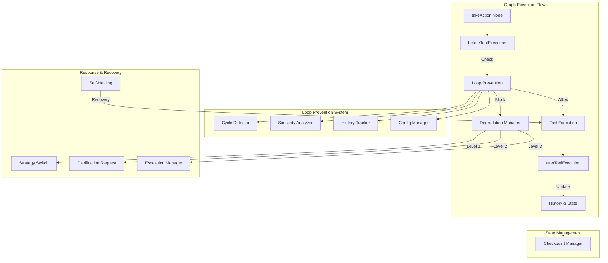

# Enhanced Agent Architecture - Remaining Work Plan

## Executive Summary

Based on a comprehensive analysis of the [`enhanced-agent-architecture-plan.md`](enhanced-agent-architecture-plan.md) and the current codebase, the implementation is **approximately 95% complete**. All core functionality has been implemented and tested. The remaining work focuses on documentation updates and minor test enhancements.

---

## Implementation Status Overview

### Completed Phases (✅)

| Phase | Status | Evidence |
|-------|--------|----------|
| **Phase 1: Foundation** | ✅ Complete | Loop prevention module structure exists at `apps/open-swe/src/utils/loop-prevention/` |
| **Phase 2: Detection & Analysis** | ✅ Complete | Semantic similarity, execution history tracking, and threshold configuration implemented |
| **Phase 3: Response & Recovery** | ✅ Complete | Degradation manager, escalation manager, and self-healing mechanisms implemented |
| **Phase 4: Advanced Features** | ✅ Complete | Checkpoint system, task decomposition, and proactive error prevention implemented |
| **Phase 5.1: Integration** | ✅ Complete | Integration with existing graphs via `integration.ts` |
| **Phase 5.2: Tests** | ✅ Largely Complete | Comprehensive test suites exist for all modules |
| **Phase 5.3: Documentation** | ⚠️ Partially Complete | AGENTS.md exists but lacks loop prevention documentation |

---

## Implemented Components

### Loop Prevention Module (`apps/open-swe/src/utils/loop-prevention/`)

| File | Purpose | Test Coverage |
|------|---------|---------------|
| [`types.ts`](../apps/open-swe/src/utils/loop-prevention/types.ts) | Type definitions and defaults | N/A |
| [`config-manager.ts`](../apps/open-swe/src/utils/loop-prevention/config-manager.ts) | Configuration management | ✅ `config-manager.test.ts` |
| [`cycle-detector.ts`](../apps/open-swe/src/utils/loop-prevention/cycle-detector.ts) | Cycle detection algorithms | ✅ `cycle-detector.test.ts` (1125 lines) |
| [`execution-history.ts`](../apps/open-swe/src/utils/loop-prevention/execution-history.ts) | History tracking utilities | ✅ Covered in integration tests |
| [`similarity-analyzer.ts`](../apps/open-swe/src/utils/loop-prevention/similarity-analyzer.ts) | Semantic similarity analysis | ✅ `similarity-analyzer.test.ts` (1280 lines) |
| [`degradation-manager.ts`](../apps/open-swe/src/utils/loop-prevention/degradation-manager.ts) | Progressive degradation logic | ✅ `degradation-manager.test.ts` (1192 lines) |
| [`escalation-manager.ts`](../apps/open-swe/src/utils/loop-prevention/escalation-manager.ts) | Human escalation flow | ✅ `escalation-manager.test.ts` (437 lines) |
| [`self-healing.ts`](../apps/open-swe/src/utils/loop-prevention/self-healing.ts) | Recovery strategies | ✅ `self-healing.test.ts` (294 lines) |
| [`history-tracker.ts`](../apps/open-swe/src/utils/loop-prevention/history-tracker.ts) | History management | ✅ `history-tracker.test.ts` |
| [`integration.ts`](../apps/open-swe/src/utils/loop-prevention/integration.ts) | Graph integration | ✅ `integration.test.ts` (222 lines) |
| [`index.ts`](../apps/open-swe/src/utils/loop-prevention/index.ts) | Module exports | N/A |

### State Management (`apps/open-swe/src/utils/state/`)

| File | Purpose | Test Coverage |
|------|---------|---------------|
| [`checkpoint-manager.ts`](../apps/open-swe/src/utils/state/checkpoint-manager.ts) | Checkpoint creation and restoration | ✅ `checkpoint-manager.test.ts` (229 lines) |
| [`index.ts`](../apps/open-swe/src/utils/state/index.ts) | Module exports | N/A |

### Task Decomposition (`apps/open-swe/src/utils/task/`)

| File | Purpose | Test Coverage |
|------|---------|---------------|
| [`task-decomposition.ts`](../apps/open-swe/src/utils/task/task-decomposition.ts) | Task complexity analysis and splitting | ✅ `task-decomposition.test.ts` (222 lines) |
| [`index.ts`](../apps/open-swe/src/utils/task/index.ts) | Module exports | N/A |

### Self-Correction (`apps/open-swe/src/utils/self-correction/`)

| File | Purpose | Test Coverage |
|------|---------|---------------|
| [`proactive-prevention.ts`](../apps/open-swe/src/utils/self-correction/proactive-prevention.ts) | Pre-execution checks and error pattern learning | ✅ `proactive-prevention.test.ts` (174 lines) |
| [`index.ts`](../apps/open-swe/src/utils/self-correction/index.ts) | Module exports | N/A |

### Shared Types (`packages/shared/src/open-swe/loop-prevention/`)

| File | Purpose |
|------|---------|
| [`types.ts`](../packages/shared/src/open-swe/loop-prevention/types.ts) | Shared type definitions and defaults |
| [`autonomous-types.ts`](../packages/shared/src/open-swe/loop-prevention/autonomous-types.ts) | Autonomous operation types |
| [`index.ts`](../packages/shared/src/open-swe/loop-prevention/index.ts) | Module exports |

---

## Remaining Work Items

### 5.2 Test Enhancements (Low Priority)

The existing test coverage is comprehensive. Optional enhancements:

- [ ] **End-to-end degradation flow test** - Create an integration test that simulates a full degradation scenario from NORMAL → WARNING → RESTRICTED → MINIMAL → HALTED
- [ ] **Performance benchmarks** - Add performance tests for similarity analysis with large histories

### 5.3 Documentation Updates (Medium Priority)

- [ ] **Update AGENTS.md** - Add section documenting the loop prevention system
- [ ] **Create configuration documentation** - Document all configurable options
- [ ] **Add UI tooltips and help text** - If applicable to the web interface

---

## Recommended Next Steps

### Immediate Actions (Phase 5.3 Completion)

1. **Update AGENTS.md** with loop prevention documentation:
   - Add a new `<loop_prevention>` section
   - Document configuration options
   - Explain degradation levels and their effects
   - Describe escalation behavior

2. **Create a dedicated configuration guide**:
   - Document `LoopPreventionConfig` options
   - Provide examples for common use cases
   - Explain tool-specific overrides

### Optional Enhancements

1. **Add end-to-end integration test** for the complete degradation flow
2. **Add performance benchmarks** for similarity analysis
3. **Consider UI integration** for loop prevention status display

---

## Architecture Diagram

---

## Conclusion

The Enhanced Agent Architecture implementation is nearly complete. The core functionality is fully implemented and tested. The remaining work is primarily documentation-focused, which can be completed in a single development session.

**Recommended Priority:**
1. Update AGENTS.md with loop prevention documentation
2. Create configuration guide
3. Optional: Add end-to-end integration test
